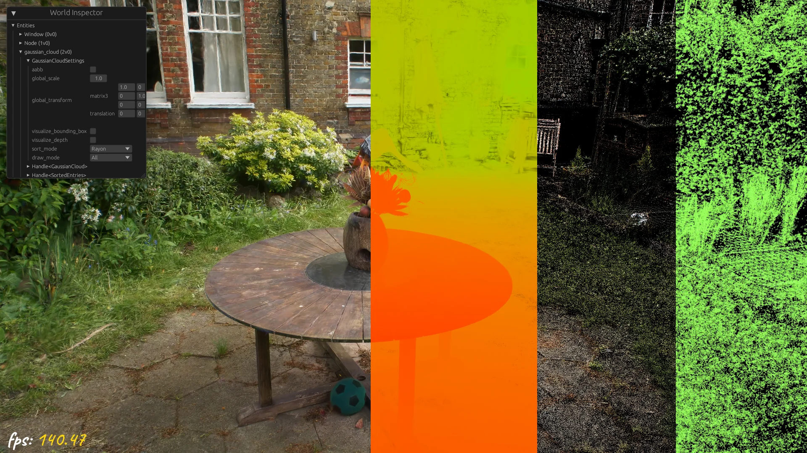

# bevy_gaussian_splatting 🌌

[](https://github.com/Mosure/bevy_gaussian_splatting/actions?query=workflow%3Atest)
[](https://raw.githubusercontent.com/mosure/bevy_gaussian_splatting/main/LICENSE-MIT)
[](https://crates.io/crates/bevy_gaussian_splatting)

bevy gaussian splatting render pipeline plugin. view the [live demo](https://mosure.github.io/bevy_gaussian_splatting?input_cloud=https://mitchell.mosure.me/go_trimmed.ply)




## install cli

```bash
cargo install bevy_gaussian_splatting
bevy_gaussian_splatting --input-cloud [file://gaussian.ply | https://mitchell.mosure.me/go_trimmed.ply]
```


## capabilities

- [X] ply to gcloud converter
- [X] gcloud and ply asset loaders
- [X] bevy gaussian cloud render pipeline
- [X] gaussian cloud particle effects
- [X] wasm support /w [live demo](https://mosure.github.io/bevy_gaussian_splatting/index.html)
- [X] depth colorization
- [X] normal rendering
- [X] f16 and f32 gcloud
- [X] wgl2 and webgpu
- [X] multi-format scenes
- [X] 2dgs
- [X] 3dgs
- [x] 4dgs
- [x] multi-cloud scene format
- [ ] gltf gaussian extensions
- [ ] 4dgs motion blur
- [ ] [deformable radial kernel](https://github.com/VAST-AI-Research/Deformable-Radial-Kernel-Splatting)
- [ ] implicit mlp node (isotropic rotation, color)
- [ ] temporal gaussian hierarchy
- [ ] gcloud, spherical harmonic coefficients Huffman encoding
- [ ] [spz](https://github.com/nianticlabs/spz) format io
- [ ] spherical harmonic coefficients clustering
- [ ] 4D gaussian cloud wavelet compression
- [ ] accelerated spatial queries
- [ ] temporal depth sorting
- [ ] skeletons
- [ ] volume masks
- [ ] level of detail
- [ ] lighting and shadows
- [ ] bevy_openxr support
- [ ] bevy 3D camera to gaussian cloud pipeline


## usage

```rust
use bevy::prelude::*;
use bevy_gaussian_splatting::{
    CloudSettings,
    GaussianSplattingPlugin,
    PlanarGaussian3dHandle,
};

fn main() {
    App::build()
        .add_plugins(DefaultPlugins)
        .add_plugins(GaussianSplattingPlugin)
        .add_systems(Startup, setup_gaussian_cloud)
        .run();
}

fn setup_gaussian_cloud(
    mut commands: Commands,
    asset_server: Res<AssetServer>,
) {
    // CloudSettings and Visibility are automatically added
    commands.spawn((
        PlanarGaussian3dHandle(asset_server.load("scenes/icecream.gcloud")),
        CloudSettings::default(),
    ));

    commands.spawn(Camera3d::default());
}
```


## tools

- [ply to gcloud converter](tools/README.md#ply-to-gcloud-converter)
- [gaussian cloud training pipeline](https://github.com/mosure/burn_gaussian_splatting)
- aabb vs. obb gaussian comparison via `cargo run --bin compare_aabb_obb`


### creating gaussian clouds

the following tools are compatible with `bevy_gaussian_splatting`:

- [X] 2d gaussian clouds:
    - [gsplat](https://docs.gsplat.studio/main/)

- [X] 3d gaussian clouds:
    - [brush](https://github.com/ArthurBrussee/brush)
    - [gsplat](https://docs.gsplat.studio/main/)
    - [gaussian-splatting](https://github.com/graphdeco-inria/gaussian-splatting)

- [X] 4d gaussian clouds:
    - [4d-gaussian-splatting](https://fudan-zvg.github.io/4d-gaussian-splatting/)
        - [4dgs ply-export](https://gist.github.com/mosure/d9d4d271e05a106157ce39db62ec4f84)
    - [easy-volcap](https://github.com/zju3dv/EasyVolcap)


## compatible bevy versions

| `bevy_gaussian_splatting` | `bevy` |
| :--                       | :--    |
| `6.0`                     | `0.17` |
| `5.0`                     | `0.16` |
| `3.0`                     | `0.15` |
| `2.3`                     | `0.14` |
| `2.1`                     | `0.13` |
| `0.4 - 2.0`               | `0.12` |
| `0.1 - 0.3`               | `0.11` |


## license
licensed under either of

 * Apache License, Version 2.0, ([LICENSE-APACHE](LICENSE-APACHE) or http://www.apache.org/licenses/LICENSE-2.0)
 * MIT license ([LICENSE-MIT](LICENSE-MIT) or http://opensource.org/licenses/MIT)

at your option.


## contribution

unless you explicitly state otherwise, any contribution intentionally submitted
for inclusion in the work by you, as defined in the Apache-2.0 license, shall be dual licensed as above, without any
additional terms or conditions.


## analytics

