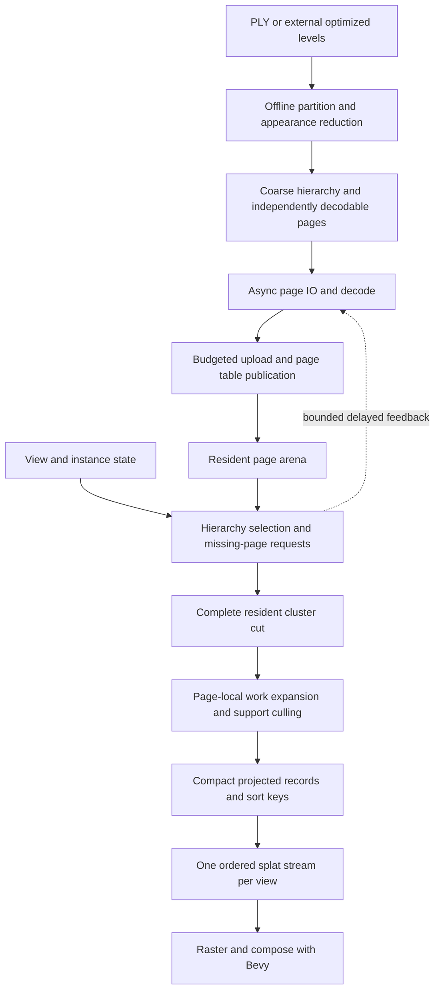

# Review of `feat/lod` and plan for a scalable 3DGS engine

Implementation follow-up: [current status and remaining gates](lod_implementation_status.md). The review below describes the original branch revisions; its line references and defects are historical evidence, not a statement that the follow-up fixes are absent.

Review date: 2026-09-06. This is an implementation plan, not a qualification report.

## Recommendation

Preserve this branch as an experimental reference and rebuild its useful pieces through small, measured changes based on current `main`. Do not merge these two commits wholesale or continue expanding their public contracts before the core quality/performance tradeoff works.

The goal should be **a virtualized, appearance-aware Gaussian renderer whose frame work and memory are bounded by visible demand and explicit budgets**. A smaller selected count is an intermediate result. The product result is a responsive camera, stable appearance, fast first useful imagery, and bounded memory on scenes much larger than the resident working set.

The branch already contains meaningful infrastructure: external-memory building, authenticated range-addressable pages, retained complete cuts, atlas generations, GPU compaction, active-count indirect sorting/drawing, and substantial tests. The next step is to simplify and connect those pieces around a measured rendering contract. It is not enough to add another hierarchy, reducer version, or quality-curve correction.

Working assumptions: static imported 3DGS/PLY assets are the first input; offline optimization is optional; the initial performance target is native desktop at 1080p; WebGPU is a separately qualified deployment profile. Rigid scene instances and multiple cameras belong in the architecture. Deforming/4D hierarchies, reconstruction training, relighting, and dynamic editing are later extensions. These are planning assumptions, not new product commitments.

## 1. Scope and evidence

| Revision | Identity | Meaning |
| --- | --- | --- |
| Reviewed branch | `7ef9bb1c918a297e35338dd7687dac55ee0db496` | `feat/lod`, clean at the start of review |
| First branch commit | `367192319a3953864b7bc57484729b130ae94111` | `feat: add production Gaussian LoD pipeline`; 104 changed files, 66,353 additions |
| Second branch commit | `7ef9bb1c918a297e35338dd7687dac55ee0db496` | `feat: attempts to make LoD SotA (fail)`; 86 changed files, 87,297 additions |
| Local `main` | `67cde03783a60c2cdccc8f877da973665cddafc2` | Includes the 8.0.2 release |
| Merge base | `9dd7bb08b42cfb4c3dd4a3915b7ab24671403e7e` | Base used for branch-only changes |

`git diff main...HEAD` reports 122 changed files, 146,333 insertions and 1,724 deletions. The per-commit additions overlap and should not be summed as final size. `main` also contains `023ccda` (additive/emissive blending) and `67cde03` (8.0.2) that are absent from this branch. Migration must preserve those changes. This review compares local refs; it did not refresh remotes.

Review work: inspect both commits, trace active build/selection/stream/render/sort paths, inspect test and benchmark coverage, and consult primary research. `cargo +1.95.0 check --locked --lib` passed on this checkout. No viewer, GPU performance suite, browser qualification, or real-scene image matrix was run for this review. Code-derived costs below are not measured bottleneck rankings. Checked-in reports are attributed to their artifacts and historical runs, not treated as fresh measurements.

### Highest-priority findings

The priorities below describe impact on the intended engine, not a claim that every item is a newly reproduced crash.

| Priority | Finding and evidence | Consequence and next action |
| --- | --- | --- |
| P1 | **Selection has no direct ordinary-quality radiance error term.** `LodView::selection_pressure` passes structural threshold, projected geometric error, coverage and certificate, but not stored appearance/opacity residuals ([hierarchy.rs](../src/stream/hierarchy.rs#L686)). Certificate authority is explicitly zero through `.90` ([lod_settings.rs](../src/gaussian/lod_settings.rs#L273)). | Color/opacity complexity cannot directly request refinement over most of the slider. Appearance influences preprocessing and high-quality certificates, so it is not wholly ignored. Replace the policy with calibrated appearance/coverage error at all quality levels. |
| P1 | **The projected-error estimate is not a general perspective error bound.** It divides by Euclidean camera-to-sphere distance ([hierarchy.rs](../src/stream/hierarchy.rs#L788)). | Off-axis/wide-FOV demand can be underestimated. Use the actual view/projection and a conservative projection bound; keep measured appearance error explicitly separate from geometric bounds. |
| P1 | **Range-descriptor storage grows to splat capacity.** The first upload exceeding the initial four-word prefix grows directly to `4 * output_capacity` words ([lod.rs](../src/render/lod.rs#L3218), [allocation](../src/render/lod.rs#L4054)). The allocation planner reserves this worst case ([limit](../src/render/lod.rs#L3247)). | A second small range can trigger about `16 * C` bytes of descriptor capacity, alongside the roughly `8 * C` evaluation tail and scan records. Range capacity and active-record capacity need separate limits and lifetimes. |
| P1 | **Dense per-cloud sort storage remains alongside private LoD sort storage.** `auto_insert_sorted_entries` allocates by camera count and source/atlas capacity ([sort/mod.rs](../src/sort/mod.rs#L265)); the draw query requires a `SortBindGroup` even when it binds LoD's private sorted output ([render/mod.rs](../src/render/mod.rs#L2842), [binding](../src/render/mod.rs#L2979)). | Private scratch limits do not describe total sort memory. Give package rendering an independent draw path and remove unnecessary dense placeholder sort assets. |
| P1 | **Shared-page validation bypasses cooperative preprocessing granularity.** After preprocessing completes, [runtime.rs](../src/stream/runtime.rs#L4551) synchronously checks node ranges and recomputes support for each contained Gaussian ([loop](../src/stream/runtime.rs#L5839)). | Application-thread work remains proportional to page/node-slice contents, outside the cooperative Gaussian slice allowance. Move node-range validation into the same worker/resumable decode job and return a validated immutable upload payload. |
| P1 | **LODGE's resident-memory preflight undercounts simultaneous copies.** It charges two catalog copies ([preflight](../src/stream/lodge_resident.rs#L1647)); construction retains decoded pages, creates a second interleaved record vector, then allocates planar vectors ([constructor](../src/stream/lodge_resident.rs#L424), [conversion](../src/gaussian/formats/planar_3d.rs#L497)). | At conversion, the decoded closure, interleaved catalog and planar catalog coexist. The decoded closure can also exceed the stable catalog. Charge actual stage peaks or eliminate intermediate copies; verify RSS separately. |
| P1 | **The available quality evidence does not establish a useful current engine operating point.** Trellis explicitly qualifies historical ABI 13, not the current builder/selector ([report](lod_quality_report.md#L3)); its approximately 33 dB common anchor retains roughly 75% of source records at 192px ([results](lod_quality_report.md#L58)). Garden's count table is explicitly before GPU compaction ([report](lod_garden_report.md#L150)). | Freeze exact artifacts and measure images, actual GPU counts, full frame time and memory together at deployment resolution. Neither a historical oracle pass nor a count reduction is the release gate. |
| P1 | **LODGE is a resident adapter, not the missing streaming engine.** Current integration materializes the complete stable-ID catalog and all cluster memberships ([docs](lodge.md#L102), [lodge_resident.rs](../src/stream/lodge_resident.rs#L329)). It also needs externally authored optimized levels. | Keep it optional. Do not make a second fully resident representation the foundation for larger-than-memory support. Reuse page transport and active-record rendering if demand paging is added later. |
| P2 | **Cache insertion sorts all unpinned resident pages even when capacity is available.** See [cache.rs](../src/stream/cache.rs#L287). | Proven avoidable `O(R log R)` work per insertion. Add an admission fast path, then a maintained eviction structure if measured churn warrants it. Preserve atomic insertion failure behavior. |
| P2 | **Range and morph lookup repeat at Gaussian/vertex frequency.** Candidate expansion binary-searches ranges ([lod_compaction.wgsl](../src/render/lod_compaction.wgsl#L140)); morph lookup also occurs in candidate evaluation and quad vertex processing ([lod_morph.wgsl](../src/render/lod_morph.wgsl#L125), [gaussian.wgsl](../src/render/gaussian.wgsl#L375)). | Encode explicit page-local work items; resolve representation, transition and projected data once per record where that is cheaper than repeated shader lookup. Benchmark bandwidth against saved ALU. |
| P2 | **Transition retirement has a quadratic lookup.** Each attestation requirement searches the removed-edge list ([lod.rs](../src/render/lod.rs#L4552)). | Index removed edges by stable key or merge sorted keys. Large changes must fit a bounded transition/commit workload. |
| P2 | **Opening a package still constructs whole-manifest runtime indices synchronously.** Instantiation builds transport/runtime and a debug manifest index even when annotations are off ([package.rs](../src/stream/package.rs#L1503), [index](../src/gaussian/lod_debug.rs#L475)). | Move validation/compilation out of the application schedule; share compact immutable indices. Measure metadata bytes and first-image latency, then page lower hierarchy metadata when necessary. |
| P2 | **CPU staging persists beyond decoded-page residency.** Atlas slot payloads are retained in a map, extraction clones a slot payload, and slot-discard is test-only ([atlas_upload.rs](../src/stream/atlas_upload.rs#L317), [extraction](../src/stream/atlas_upload.rs#L512)). | This is bounded by atlas capacity, not an unbounded leak, but navigation can fill a second CPU representation of the atlas. Include it in the total ledger and share/release immutable staging with explicit recovery policy. |
| P2 | **The default demo asks for exact detail.** Viewer defaults are quality `1`, an 8M active ceiling, 64 requests and zero hysteresis ([utils.rs](../src/utils.rs#L14)). | The default behavior does not demonstrate useful LoD. After calibration, use a budgeted performance profile, explicit exact-reference mode, and visible degraded/unmet-target state. |

The off-axis issue is demonstrable without a GPU: for a camera at the origin facing `-Z`, focal length 1,000px, node center `(5, 0, -5)`, radius `0.1`, and spatial residual `0.01`, the current formula gives approximately `1.4345px`. A horizontal displacement of `0.01` at depth 5 projects to `2px`; the largest local Jacobian direction gives about `2.8284px`. This demonstrates a limitation of the projection heuristic, not a measured PSNR loss for Garden.

### What the branch gets right

- The LoD renderer really does compact candidates and derive indirect work from active results. Recommending “add compaction” without acknowledging this would repeat work already present.
- Stable virtual page identities, slot generations, complete-cut retention, bounded upload admission, authenticated ranges, and render publication checks address real correctness problems. Preserve their invariants while simplifying their implementation.
- Logical nodes and physical pages are already partly decoupled: the progressive CPU builder uses fine logical leaves packed into bounded physical pages. Extend this separation instead of reverting to one object per splat.
- Stationary reuse exists. Camera motion appropriately invalidates view-dependent culling and sorting; removing that invalidation would create visibility/order defects. Optimize how much useful work must be redone.
- CPU rendering, synthetic edge cases, GPU tests, recovery tests and browser transport tests are valuable. Preserve tests that prove behavior, while replacing source-string assertions with actual execution where execution matters.

### Structural problems behind the findings

The branch couples representation experiments, policy, physical storage, transition proof, GPU scratch, recovery, multiple builders, and public API evolution in very large modules. `stream/runtime.rs` exceeds 12,000 lines including tests; `render/lod.rs` exceeds 8,000; `planar_3d_lod.rs` exceeds 9,000; one render-quality test file exceeds 12,000. File size alone does not prove a defect, but this organization makes a change to one invariant difficult to review and profile independently.

The builder's `geometric` quantity is based on source support extent around the representative, while appearance/opacity are different units ([planar_3d_lod.rs](../src/gaussian/formats/planar_3d_lod.rs#L3695)). That is useful conservative metadata, but it is not a calibrated image residual. Depth-authored quality thresholds and several slider guards compensate for a representation whose error is difficult to predict. Further curve tuning will not produce a strong rate/quality frontier by itself.

The strongest reductions also use the least appearance-aware partitioning. Risk-aware adjacent grouping is restricted to an average reduction ratio of at most 16; coarser rungs use balanced Morton intervals ([in-memory builder](../src/gaussian/formats/planar_3d_lod.rs#L3933)). The external path additionally caps the eligible source domain at 8,192 records ([external builder](../src/io/lod_build_external.rs#L3066)). Even improved payloads inherit a separately constructed balanced partition's selection envelope. This contains unproven quality changes, but prevents a better fit from automatically earning lower selection cost. The replacement must measure the actual encoded payload and permit difficult regions to retain more records.

Garden's ABI 16 fitter improves sampled seams inside bounded same-depth future-parent cohorts. Its report explicitly leaves source-less, cross-future-parent and mixed-depth cases outside that fitting scope ([Garden report](lod_garden_report.md#L90)). Those limits call for joint appearance validation of the selected cut, not an assertion that all boundaries have been solved.

## 2. The useful Nanite analogy

Borrow hierarchical clusters, offline preparation, virtual pages, GPU work generation, screen-dependent detail, and resident coarse fallback. Epic describes cluster substitution and on-demand streaming as central mechanisms of Nanite. [Epic's Nanite overview](https://dev.epicgames.com/documentation/en-us/unreal-engine/nanite-virtualized-geometry-in-unreal-engine).

The following is an engineering synthesis for this repository. Alpha-composited Gaussians need different visibility and approximation contracts from opaque triangles:

- Geometric support proximity does not imply similar appearance. Two overlapping layers with different colors cannot generally be replaced by one covariance/SH average without changing view-dependent compositing.
- Fewer Gaussians can still be slower when their projected footprints and overlap grow. Budget contribution work and sort/binning work as well as record count.
- Parent/child transitions affect coverage, opacity, color, covariance and ordering. A transition that preserves an integrated quantity can still change individual pixels.
- Gaussian centers do not define opaque surfaces. Do not build occlusion from nearest splat-center depth and claim conservative hidden-surface removal.
- Pixel count alone does not bound arbitrary transparent depth complexity. Predictable frame time requires admission/degradation policy for pathological content.

The target complexity is approximately:

```text
CPU/frame: O(changed requests + completed pages + changed instance/view state)
GPU/frame: O(visited resident hierarchy nodes + active candidates + raster work)
Memory:    O(coarse index + resident pages + per-view work + bounded in-flight data)
```

This is an architectural objective, not a worst-case constant-time guarantee. A camera showing all unique detail can exhaust any finite budget; the engine must report which target it could not meet.

## 3. Target data flow and ownership



### 3.1 Separate three granularities

**Logical clusters** are units of selection and approximation. A cluster owns a bounded set of records representing one spatial/appearance domain. Start by benchmarking 128/256/512-record cluster targets and fanout 4/8; do not freeze these into a public ABI before measuring them. Preserve a tree/forest first. A DAG adds sharing and boundary dependencies that are unnecessary until a measured tree limitation justifies it.

**Physical pages** are units of transfer, decompression and residency. Pack multiple small clusters per page, and allow an oversized cluster representation to span an explicitly declared dependency set. Start with 64/128/256 KiB encoded-page experiments, track decoded and GPU sizes separately, and coalesce adjacent ranges for HTTP. The best network request size need not equal either the cluster or physical page size.

**GPU work items** are fixed-sized slices of a resident cluster. Each carries direct page/slot address, first record, count, instance ID and transition ID. Workgroups consume these slices directly; a Gaussian should not repeatedly search a list of unrelated ranges to find its owner.

### 3.2 Compact, versioned runtime interfaces

Establish internal types before another public format revision:

```text
SceneRoot        coarse roots, bounds, page directory identity, representation profile
ClusterMeta      support bounds, child span, representation refs, error profile
PageTableEntry   resident slot/slab, valid record count, generation
WorkItem         cluster/page slice, instance, transition
ActiveRecord     projected data or record address, sort key, evaluated transition
Request          virtual page ID, generation, priority, request epoch
FrameStatus      counts, timings, byte ledger, quality/coverage outcome, frame identity
```

Use 64-bit virtual identities/offsets in the package where required, and compact 32-bit slot/local indices in WGSL. A billion-record package must not imply a billion-record binding. Initially use portable storage-buffer arenas/slabs; do not require unbounded descriptor indexing or mesh shaders. Respect both individual binding limits and total allocation limits.

Keep decoded asset/page state shared across views. Keep selection, projected data, sorting and transition presentation per view. Serialize only compact immutable handles and actual changes across Bevy's main/render worlds. Ordinary camera motion must not rebuild a `PlanarGaussian3d` asset or copy all resident Gaussian planes.

Multiple overlapping clouds need one globally ordered active stream per view, or an explicitly proven ordering/compositing method. Sorting every cloud independently and then drawing whole clouds by one entity depth is insufficient for interleaved translucent geometry. The opt-in [global quad backend](global_quad_order.md) now implements a bounded shared projected stream and one radix-sorted draw for flat and discrete CPU-selected clouds; qualification is pending, and GPU hierarchy snapshots are not yet supported by that backend. The implemented opt-in [Gaussian Point Splatting backend](gaussian_point_splatting.md) instead shares stochastic visibility across participating clouds in one view; a two-cloud native GPU screen passes. It retains Gaussian center-depth semantics and does not prove correct composition with separate transparent backends.

The implemented bounded consumers bind each source slab for projection into one shared per-view projected-record stream, then globally sort and rasterize that stream for supported quads or resolve shared point visibility for GPS, without arbitrary source-slab access. Their capacities must fit the negotiated limits; the new global quad path still needs image/performance qualification. A larger profile needs an explicit bounded merge/compositing strategy; drawing one complete slab at a time would reintroduce ordering errors.

### 3.3 A page state machine with one owner per transition

```text
Absent -> Requested -> Encoded -> Decoded -> Uploading -> Resident
                     failures/cancellation -> retry or Absent
Resident -> Retiring -> Reusable
```

Pages become selectable only after their contents and page-table generation are valid for submitted render work. A CPU handle drop is not proof that an earlier GPU submission has finished reading a slot. Retire by tracked submission lifetime; reject stale completions by page identity, scene identity and generation.

A resident coarse forest is the fallback. Refine one replacement group only when all children required to replace its parent are available and all output/transition budgets are reserved. If they are not ready, render the parent. Do not fill a cut with arbitrary available children, truncate a Gaussian list, or discard an entire parent simply to satisfy an active-count cap.

Publish locally complete replacement groups. Keep per-view presentation independent so one slow camera does not impose a scene-wide visual stall; retain shared pages until every referencing view/submission releases them. Preserve the existing branch's coverage and retirement invariants while reducing the scope of its aggregate coordination.

If the complete minimum coarse forest itself cannot fit, reject the requested scene configuration with a quantified minimum requirement. For intentionally streamed world sectors, declare which sectors are currently covered instead of silently treating missing sectors as empty space.

## 4. Build a representation that earns its savings

### 4.1 Two authoring tracks feeding one runtime

**Track A: existing PLY/assets.** Build deterministically from source records using spatial/support-aware clustering. Keep exact originals at the finest level. Offer a fast geometric initialization and a slower appearance-optimized mode. Where source photos are unavailable, render the original splats as a teacher over sampled views; call the result teacher-matched, with an explicit sampled camera domain.

**Track B: images/cameras or externally optimized levels.** Import or optimize multiscale representations with training views and held-out evaluation. Keep training dependencies outside the viewer/library runtime. Expose an exporter contract into the same pages and render interfaces rather than a second streaming stack.

Hierarchical 3DGS explicitly optimizes merged intermediate representations, and LODGE combines smoothing, importance pruning and fine-tuning. These support treating offline appearance optimization as a serious option rather than assuming moment matching alone is sufficient. [Hierarchical 3DGS](https://repo-sam.inria.fr/fungraph/hierarchical-3d-gaussians/), [LODGE](https://arxiv.org/abs/2505.23158).

### 4.2 Proposed offline stages

The in-memory and external builders must share one versioned clustering, reduction and error recipe. External memory changes scheduling and I/O, not representation semantics. ABI 14 Trellis and ABI 16 external Garden evidence cannot qualify each other merely because both are called LoD.

1. **Normalize and validate.** Preserve coordinate, quaternion, SH, opacity, color-space and scale conventions. Record the exact input hash and interpretation. Reject non-finite values; identify giant support/outlier splats rather than letting them contaminate every spatial bound.
2. **Partition out of core.** Retain deterministic external Morton sorting as a useful first ordering, then form compact clusters using support extent, covariance orientation, opacity/radiance variation and spatial adjacency. Avoid merging separate walls, foliage layers or foreground/background merely because their Morton indices are adjacent. Use page/cluster-local coordinates for large world extents.
3. **Initialize coarse candidates.** Compare moment merge, importance-preserving subsets, and small Gaussian mixtures. A parent is a bounded representation with as many records as the measured error permits; it does not have to collapse to one very broad Gaussian.
4. **Optimize rendered appearance.** Fit projected color and transmittance at several scales and directions, including neighboring context. Preserve PSD covariance, finite opacity and conservative support. Evaluate the composite with occluding neighbors so an isolated-cluster optimum does not create cut boundaries.
5. **Treat interfaces explicitly.** Use overlap/halo source context during fitting, unique ownership for emitted records, and selected mixed-depth cuts in validation. Do not duplicate halo Gaussians into both neighboring draws. If fitting remains unsafe, retain more representatives or mark that replacement unsuitable for the affected scale/view domain.
6. **Measure errors and costs.** Store calibrated residual summaries, support bounds and representation cost. Include quantization and filtering in this measurement. Sample angular bins only if they materially improve the frontier; label sampled confidence rather than calling finite-camera coverage a universal certificate.
7. **Pack and verify.** Lay out bootstrap representations first, pack spatially/locality-related clusters, write independently decodable pages, authenticate page identities, then publish atomically. Record peak RSS, temporary disk, bytes read/written and time per stage.

Compare candidates by a rate/quality frontier at matched views and resolution. A new reducer advances only if it lowers actual rendering/working-set cost at the same image and temporal thresholds. If strong reduction is not possible for an asset, emit that fact. Do not hide it behind a slider that silently resolves to nearly all originals.

### 4.3 Error model and public quality policy

Separate three quantities with explicit units:

- Conservative geometric/support bounds, used for safe projection and visibility.
- Measured appearance residuals: linear RGB, transmittance/alpha, silhouette/boundary, view-dependent color and scale behavior.
- Predicted work: candidate count, projected footprint, tile intersections/depth complexity, resident/upload bytes and transition overhead.

Use the actual camera transform and projection. For perspective, project support/error through a conservative bound on the projection Jacobian over the relevant volume, including off-axis position and near-plane intersection. For orthographic cameras use the exact linear scale. Test nonuniform transforms, mirrored instances, asymmetric frusta and physical-pixel viewport changes. Camera-relative rendering must preserve the same error units as the builder.

Initial user-facing policy should expose an error/quality target, a frame-time target and memory/work limits. A familiar `quality` slider can map monotonically to calibrated thresholds; it should not directly request a fraction of scene records or turn appearance protection off below an arbitrary high-quality anchor.

Maintain an exact-reference mode. Its result must explicitly distinguish “requested exact,” “all required original data ready,” and “budget prevents exact.” For large scenes, exact visible demand can still exceed resources. Never claim an exact endpoint when a budgeted coarse fallback is on screen.

### 4.4 Filtering and transitions

Settle flat-source projection/filtering conventions before judging the hierarchy. Compare `main`'s original raster, this branch's flat raster, and an independent pinned renderer separately; otherwise changes to the flat baseline can make an LoD comparison misleading. The branch's determinant-normalized screen filter is useful to evaluate, but a post-hoc 2D filter is not Mip-Splatting's training-frequency 3D filter. [Mip-Splatting](https://niujinshuchong.github.io/mip-splatting/).

First prove static parent and child endpoints. Keep deterministic discrete-cut debug mode permanently. Introduce temporal presentation only after useful coarse endpoints exist.

The production transition must have explicit endpoints, bounded residency, bounded extra work, and interruption behavior. Compare the existing optical-depth morph against a bounded union transition and, where correspondence is reliable, geometric/covariance interpolation. Simple opacity fades do not automatically preserve pixel radiance; independently interpolating Gaussian parameters does not either. Select the method using rendered dynamic tests, not an algebraic invariant alone.

Store transition state once per replacement group, evaluate per-record presentation once where possible, and reserve overlap headroom before beginning. Reversal should continue from the displayed state; camera teleport should immediately choose a valid resident fallback. If a transition cannot be admitted, keep a complete endpoint and report delayed refinement.

The existing morph renders child-cardinality proxies even at its coarse parent endpoint: coincident proxies divide the parent's optical depth ([gaussian.wgsl](../src/render/gaussian.wgsl#L538)). Coarse appearance can therefore retain fine-level draw and fill cost while that representation is active. Count proxy records and projected footprint separately, cap both, and retire a completed transition to the actual compact parent representation as soon as its lifetime permits.

LODGE's nearest-pair selection has a separate nonzero-weight neighbor-swap problem acknowledged by the branch. Keep that limitation explicit. A generalized spatial blend would be a new method requiring its own evidence, not a free consequence of implementing the adapter.

## 5. Runtime performance design

### 5.1 Incremental selection before GPU traversal

First establish a compact CPU reference with reusable arrays, deterministic cuts, changed-view/changed-residency invalidation, and bounded per-update work. Use a priority queue or bucketed refinement work list instead of rediscovering the whole desired cut on every update. Stationary selection should reuse its prior result; camera motion should examine plausible frontier changes, not reconstruct manifest-wide metadata.

Then implement GPU hierarchy traversal over resident metadata and compare with the CPU reference. Use bounded queues/work batches and indirect dispatch; WGSL has no requirement for recursive traversal or a cross-workgroup global barrier inside a dispatch. A multi-pass work queue is an acceptable initial implementation. Reserve complete replacement groups before modifying the cut, and preserve a ready parent when a queue/output limit is reached.

Generate missing-page demand on the GPU, deduplicate into bounded feedback, and read it asynchronously with a small ring. The CPU performs I/O scheduling; it does not wait for the current frame's counts before drawing. A one/few-frame request delay is covered by resident parents and directional prefetch. Queue overflow must be visible and recoverable.

### 5.2 Work-based budgets

A count cap cannot distinguish a million subpixel splats from a hundred thousand screen-filling splats. Start with:

```text
predicted GPU work = a * candidates
                   + b * sort items
                   + c * projected footprint or tile pairs
                   + d * measured dense-tile contribution work
```

Fit coefficients per supported adapter/profile from timestamps. Keep them diagnostic until their predictions are stable; hard capacities remain authoritative. Refine by expected image improvement per additional work/byte, using projected visibility and request latency for scheduling. A deterministic priority ordering is needed for reproducible captures.

A slow controller can adjust target error to meet a frame-time budget using smoothed timings, hysteresis and limited change rate. Freeze it during controlled quality/benchmark sweeps. When a frame is over budget, distinguish sort, fill, selection, upload and CPU submission pressure; do not worsen geometric quality to solve an unrelated upload stall.

GPS adds a separate sampling budget: projected opacity mass determines expected point work, while Gaussian/page counts still bound projection and residency. Its automatic controller changes complete sample layers using optional real GPU timestamps or confirmed point overflow, never per-Gaussian point thinning. Eligible GPS views retain their backend claim during admission failure and can preserve a completed image. An optional outer view-GPU controller trials bounded hierarchy-cap reductions after sampling reaches one layer, checks whether coarser representatives actually cost less, and rolls back worse changes. Neither controller satisfies the representation-quality gate or reports CPU wall time as GPU timing.

### 5.3 Compaction, sorting and projection

Retain the branch's active-count indirect design. Replace capacity-sized descriptor prefixes with descriptor-sized arrays and page-local dispatch items. Use a global prefix scan over work-item counts, then local expansion/culling. Resolve morph ownership from the work item; avoid binary search in each quad vertex.

Measure a projected-record cache: compute covariance/conic, depth, support, color and transition once per surviving Gaussian, then render cheap vertices or consume the record in a tile renderer. SH3 bandwidth may dominate; do not materialize extra fields without measuring the bandwidth/ALU tradeoff.

Quad sorting now uses full 32-bit **forward camera depth** (`-view-space Z`) through a shared [key helper](../src/render/helpers.wgsl). Pure camera rotation invalidates sorting; lateral motion no longer creates radial-distance order reversals. Earlier radial-order captures remain historical evidence. Local tile/ray ordering remains a separate quality experiment: a global center-depth key is still approximate for extended anisotropic splats. Benchmark 16/24-bit variants with close-depth, large-depth-range, overlapping-color and camera-rotation tests. Quantization is an explicit quality option, not a silent performance fix. Membership, geometry and relevant view changes must invalidate the corresponding output; topology reuse does not itself justify reusing visibility or order.

Check actual outputs: input candidates, post-support/frustum active count, emitted sort items, radix dispatch sizes and draw instances. A shader-side discard after sorting is not equivalent to reducing sort work.

### 5.4 Raster work is a separate engine problem

Keep the quad renderer as the initial compatibility baseline. If timestamps show fill/overdraw dominates after active-set fixes, prototype a compute tile renderer with projection, bounded binning, sorted tile/macro-tile work, front-to-back accumulation and transmittance termination. Include binning buffers, pair duplication, scratch and composition in the comparison.

The [GPS alternative](gaussian_point_splatting.md) implements shared projection, opacity-corrected point sampling, two portable 32-bit depth/winner passes and premultiplied resolve with opaque mesh depth. Its profile is planar 3D Color, non-additive clouds, discrete LoD cuts and MSAA off. GPS consumers omit LoD radix workspace and dispatch; flat identity-index storage remains a compatibility cost. Bounded GPU hierarchy traversal now emits physical records and deduplicated page demand, connected to authenticated whole-page publication with fenced snapshots. The focused native traversal oracle and GPS image tests passed on Vulkan RTX PRO 6000 Blackwell, driver 610.43.02. Full package integration and broader qualification are tracked in the current status document.

The bounded 84,348-record real-source GPS screen did not demonstrate a speedup: at 480×270 its median instrumented view intervals were 0.493 ms for quads, 0.507 ms for one GPS layer and 1.586 ms for four layers. Four layers reduced noise but generated 20.74M points. At 720p, the default 16M-point limit overflowed even at one layer. These results establish the need for separate point-work admission; they are not an equal-quality performance or large-scene scaling claim.

Study StopThePop for order-related motion artifacts, and HiGS for separating partitioning scale from raster tile scale and handling dense work. These are references for experiments; their implementation assumptions and reported speedups are not portable promises for Bevy/WGSL. [StopThePop](https://r4dl.github.io/StopThePop/), [HiGS](https://research.nvidia.com/labs/sil/projects/higs/).

Integrate Bevy opaque depth conservatively: clip only splat contributions demonstrably behind supported opaque geometry. Treat splat-only occlusion as a later transmittance/error-bounded optimization. Sparse depth/nearest-center Hi-Z is unsafe for arbitrary transparent layers. Tile early termination also needs a documented radiance/transmittance tolerance, particularly for HDR or emissive content.

Handle dense/giant-footprint work explicitly. No unbounded tile-pair allocations; reserve or detect overflow before emission and fall back to a valid renderer/cut. Never drop the tail of an overflow list and present it as successful rendering.

### 5.5 Memory and streaming ledger

One budget authority should account for all of these categories, per scene and across scenes/views:

```text
CPU = coarse/loaded hierarchy + encoded cache + decoded pages
    + decode jobs + upload staging + active/request metadata
GPU = resident payload + page tables + derived covariance planes
    + per-view candidates/projected records + both sort buffers + scan scratch
    + tile/raster scratch + transition overlap + in-flight retired allocations
```

Count allocated capacity and high-water values, not just live record bytes. Deduplicate shared page accounting; do not double-count one shared allocation or omit it from every owner. Include Bevy/render-target overhead in device-level measurements and leave headroom outside the engine budget.

The current canonical SH3 record is 240 bytes before an optional derived covariance plane: 48 floats of SH plus three 16-byte fields. Thus 100M records alone would require about 24 GB decimal, and 1B about 240 GB, before hierarchy, copies, sort or raster scratch. This is layout arithmetic from [planar_3d.rs](../src/gaussian/formats/planar_3d.rs#L47) and [SH layout](../src/material/spherical_harmonics.rs#L78), not a measured process footprint. Full-catalog materialization is incompatible with the goal.

Page cache design: admission fast path; maintained eviction ordering only when needed; parent/transition/in-flight pins; deduplicated requests across views; cancellation by generation; latency-aware prefetch; adjacent range coalescing without unbounded overfetch; byte-bounded decode/upload queues; backpressure from upload through I/O. An exhausted budget should reduce refinement pressure while retaining coverage.

Workers/resumable browser jobs should finish checksum, finite-value, page-bound and node-slice-bound validation plus upload packing before commit. Share their immutable payloads across worlds, and release staging or account for deliberate recovery retention. Bound negative-cache/failure entries with expiry and retry policy: the current permanent failure maps grow with distinct failed pages ([runtime.rs](../src/stream/runtime.rs#L4635)). Preserve global worker pools and upload fairness already present; add one total residency authority across packages, rather than treating each package's atlas ceiling as an application-wide limit.

Keep only a coarse index permanently resident. Compact full metadata may be acceptable at the first 100M target, but measure its size and startup construction. Lower hierarchy pages need their own parent fallback/request rules before claiming billion-scale bounded startup. Authentication must permit early bootstrap without downloading every payload shard first.

Compression is orthogonal to LoD: quantize page-local positions, log scales/rotations and SH coefficients only after the uncompressed reference works. Keep base color and higher-order SH separable if experiments justify it. Measure decode time, upload bandwidth, covariance stability, SH angular error and random access. A smaller download that is always expanded to an oversized GPU catalog does not solve residency.

## 6. Validation and acceptance gates

### 6.1 Freeze a reproducible experiment

Each run records source/package SHA-256, builder and renderer revisions, feature flags, adapter/backend/driver, resolution, physical pixel scale, camera path hash, sorting/filtering mode, quality/budgets, cache state and instrumentation mode. Hash generated assets rather than referring to whichever package currently exists under `target/`.

Capture three references: current `main` flat rendering, current branch flat exact rendering, and a pinned independent renderer with matched camera/SH/alpha/color conventions. Differences between them must be classified before using one as a hierarchy oracle. CPU oracle and GPU renderer remain separately reported.

Garden and Trellis are required regression assets, but Garden's approximately 5.8M records do not establish very-large-scene scaling. Add indoor thin geometry, vegetation, outdoor street/campus, and adversarial synthetic scenes. Use both increasing unique data and controlled instancing. Repeated copies are valid stress tests but are not evidence of billion-record unique-scene quality.

### 6.2 Required measurements

| Area | Measurements |
| --- | --- |
| CPU | Per-system selection, request scheduling, decode, package setup, atlas commit, extraction, render preparation, command encoding; allocations and copied bytes; worker queue latency |
| GPU | Timestamps for traversal, expansion/cull/scan, projection/SH/morph, sort, raster and composition; submission/frame timing |
| Counts | Nodes visited, clusters selected, candidate records, support/frustum survivors, sort items, indirect dispatch/draw counts, tile pairs and dense-tile/depth-complexity distributions |
| Memory | Full CPU/GPU category ledger, reserved versus used capacity, staging, transition and retirement peaks, device-level memory observations |
| Streaming | Time to first covered image, time to requested quality, latency percentiles, pending/duplicate/cancelled requests, bytes transferred/decoded/uploaded, hit rate, stale-frame duration |
| Quality | Matched-resolution RGB PSNR/SSIM, optional LPIPS/FLIP with pinned implementation, foreground and full-frame metrics, alpha/transmittance error, silhouette IoU, local boundaries, projected size/aspect, temporal residuals |
| Experience | p50/p95/p99 frame time, long-frame counts, camera response during load and motion; final visual review of deterministic clips |

Production telemetry uses delayed timestamp/count readback and identifies the frame/generation measured. Never label last frame's frontier count as this frame's draw count. Blocking readback is acceptable for isolated correctness tests, not the normal render loop. Run uninstrumented timing comparisons too, to quantify instrumentation overhead.

### 6.3 Test matrix

| Test family | Cases and invariant |
| --- | --- |
| Cut/coverage | Empty scene, one cluster, deep hierarchy, missing siblings, unavailable children, disjoint roots; every selected domain is represented exactly once at a complete endpoint |
| Projection/support | Off-screen center with visible support; camera inside bounds; near-plane crossing; wide/asymmetric FOV; orthographic; nonuniform/mirrored transforms; giant splats; viewport resize |
| GPU compaction/sort | 0/1/255/256/257, 1,023/1,024/1,025, 65,535/65,536/65,537 and million-scale counts; arbitrary range fragmentation, equal depths, randomized visibility; compare full membership and ordering to CPU |
| Radiance | Thin rails, layered red/blue transparency, opacity extremes, high-frequency SH, grazing angles, sparse foliage, high dynamic range; endpoint and mixed-depth appearance |
| Motion | Static camera, slow orbit, fly-through, dolly zoom, rotation without translation, threshold oscillation, interrupted/reversed transitions, teleport and return; no persistent holes or stale ordering |
| Streaming | Cold/hot local cache, throttled/high-latency HTTP, partial ranges, errors, cancellation, out-of-order completion, corruption, rapid revisits; bounded bytes and correct fallback |
| Residency | Tight atlas, all pages pinned, transition budget exhaustion, slot reuse, retired submissions, device loss, scene unload during I/O; no stale-page reads or leaked ownership |
| Bevy integration | Two views with independent cuts, overlapping clouds, instance transforms, opaque mesh intersections, resize and recovery; shared storage and per-view correctness |
| Scaling | 5M/25M/100M and 1B virtual source; same visible domain/budgets while adding distant data; record metadata growth, startup and steady-state slopes |
| Deployment | Native NVIDIA/AMD/Intel and Apple/Metal where supported; real WebGPU browser cold/warm sessions separately; each declared SH/covariance profile |

Do not require rendered PSNR to be strictly monotone at every slider increment: cuts and foreground masks are discrete. Require bounded regressions and a useful rate/quality frontier. Likewise, strict near/mid/far count ordering is appropriate for controlled fixtures, not every arbitrary camera whose occlusion/content changes.

The existing Trellis workflow invokes a CPU selection/raster oracle even with `headless` enabled ([test](../tests/lod_real_scene_quality.rs#L2576), [workflow](../.github/workflows/lod-quality.yml#L87)). Keep it, but add matched GPU package/runtime frames. `benches/lod_gpu.rs` benchmarks offline preprocessing/reduction ([entry](../benches/lod_gpu.rs#L111)), not runtime frame performance. The branch also has actual GPU CI tests; the gap is representative, current-artifact end-to-end performance evidence, not absence of all GPU coverage.

### 6.4 Initial numerical targets to calibrate, then lock

These are proposed engineering gates. They have not been measured on this branch. Phase 0 selects a named desktop adapter and may revise them once before implementation; do not continually relax them to pass a reducer.

| Target | Proposed gate |
| --- | --- |
| Native responsiveness | 1920x1080, 60 Hz target; whole-frame p95 <=16.7ms and p99 <=25ms on a pinned fly-through; report all >50ms frames |
| Runtime CPU overhead | Warm per-frame LoD orchestration p95 <=1ms; page processing time-sliced so the application thread does not stall on package-wide work |
| Working-set example | On a nominated 8 GiB-class device, start with 2 GiB payload and 4 GiB total engine allocation ceilings, leaving the rest for Bevy/OS and headroom; measure actual adapter limits |
| Useful visual reduction | At matched ordinary mid/far views, target >=4x reduction in post-cull records and >=2x whole-frame improvement over flat rendering, with foreground PSNR >=35 dB and SSIM >=.98 plus local/alpha/temporal gates |
| No easy-scene regression | Flat/reference path overhead <=5% on already-fast small scenes under repeatable unthrottled comparison |
| Source-size independence | Growing distant source from 10M to 100M with fixed visible working set increases warm p95 runtime overhead by <=10%; explain metadata/startup growth separately |
| First useful image | <=1s local and <=2s under a stated 50Mbps/50ms-RTT profile after renderer initialization, provided the bootstrap package fits the declared transfer/compute envelope |
| Memory safety/lifecycle | No cap overrun including transitions and in-flight retirement; stable high-water after repeated camera circuits and scene load/unload |

The 4x reduction target is a quality-feasibility checkpoint, not a universal guarantee for every close-up. If representative assets cannot reach it, change the reduction/authoring method before adding engine complexity. Absolute real-photo PSNR and teacher-relative PSNR answer different questions and must not be mixed. Define alpha, local-boundary and temporal tolerances from the fixed baseline/fixtures in Phase 0, publish them, then keep them stable.

## 7. Implementation sequence and reviewable changes

### Phase 0 — establish the baseline and contain the experiment

**Deliverables:** preserve the branch; start a new development branch/worktree from current `main`; import a minimal experiment harness and the smallest required package path; pin Garden/Trellis plus a representative camera route; add structured counts/timestamps/byte accounting. Keep LoD explicitly experimental until its gates pass. Isolate flat raster corrections into separately reviewed changes.

**Initial A/B runs:** flat `main`; branch flat exact; package exact; fixed coarse cut; dynamic LoD; transitions on/off. Use quality `0/.35/.65/1` only as diagnostic samples, with 100k/500k/2M caps, 540p/1080p, editor off/on, 16/32-bit sorting, stationary/orbit/fly-through, cold/warm cache. Pair every image with the actual cut/render count at that resolution. Do not claim a low-quality fast image passes the quality gate.

**Touchpoints:** `src/testing`, `src/stream/status.rs`, `src/render/lod.rs`, `src/sort/radix.rs`, viewer diagnostics, and a new deterministic runtime benchmark/capture tool. Reuse existing fixtures and tests where they exercise the intended behavior.

**Exit:** one reproducible report attributes frame time, memory and visible artifacts to concrete stages and distinguishes current findings from historical reports. Select hardware/quality gates before the next phase. No claim of success from startup or compilation.

### Phase 1 — remove known overhead without changing representation

**Changes:** split flat/package sort/draw state; size descriptors independently; add cache admission fast path; index transition retirement keys; move package compilation and shared-page validation off the application schedule; correct resident-construction preflight accounting; make debug-only data lazy where runtime ownership permits; add delta-only extraction and allocation accounting. Keep current cut/appearance behavior as the comparison reference.

**Touchpoints:** `src/sort/mod.rs`, `src/render/mod.rs`, allocation portions of `src/render/lod.rs`, `src/stream/cache.rs`, package initialization/indices and atlas transfer.

**Exit:** equal endpoint images and candidate membership; measured memory deltas agree with the allocation ledger; no repeated full-source/atlas payload copies during camera-only motion; changed-page CPU spikes bounded. Each optimization has its own before/after result. Do not bundle all of these into one refactor.

### Phase 2 — prove a useful representation and error policy

**Changes:** implement the projection fix and independent appearance residual policy; compare current moment merge against support/appearance-aware cluster mixtures and optional teacher optimization; validate neighboring/mixed-depth cuts. Keep static-cut rendering for this phase.

**Touchpoints:** split `planar_3d_lod.rs` into builder/reduction/quality/format responsibilities; retain external sort in `io/lod_build_external.rs`; isolate quality policy from `lod_settings.rs` and `stream/hierarchy.rs`.

**Exit:** matched-resolution rate/quality curves on Garden, Trellis and at least one structurally different scene reach a useful operating point. Held-out cameras and local boundaries pass. If this fails, stop downstream feature expansion and revise the authoring method. GPU traversal cannot rescue a poor approximation frontier.

### Phase 3 — make demand paging a small, complete runtime

**Changes:** one page state machine; shared immutable hierarchy indices; explicit minimum coarse cover; complete-group replacement; byte-bounded request/decode/upload queues; submission-aware page retirement; multi-view page-demand union. Use a CPU selector first so streaming faults can be debugged independently of GPU traversal.

**Touchpoints:** extract focused modules from `stream/runtime.rs`, `package.rs`, `bridge.rs`, `render_commit.rs`, and `atlas_upload.rs`. Adapt existing generation and failure tests. Preserve authenticated range access and atomic package publishing.

**Exit:** a 100M virtual scene renders under the working-set ceiling through cold start, movement, rapid return and eviction; no holes from partial refinement, no synchronous page-load stalls, and no unaccounted transition/retirement memory. First-image latency is measured. Unique-scene quality remains a separate required qualification.

Phases 2 and 3 can proceed in parallel after shared cluster/page contracts and Phase 0 evidence exist. Their integration must preserve the same representation, cut and residency identities.

### Phase 4 — GPU work generation and projection

**Changes:** bounded GPU traversal with CPU parity oracle; asynchronous deduplicated page feedback; direct page-local work items; active-count compaction; one-time projection/radiance evaluation where beneficial; global per-view ordering for quads or qualified shared GPS visibility across instances. Retain efficient CPU traversal as a fallback and debugging oracle.

**Touchpoints:** new focused traversal/work/compaction modules under `render`, corresponding WGSL, `sort/radix.rs`, and render graph ordering. Reuse validated prefix-scan/indirect machinery where it meets the contract.

Page-local expansion and one-time projection can land earlier using CPU-selected work items if measurements support them; they do not depend on GPU hierarchy traversal.

GPS consumes the existing flat/discrete candidate input and introduces the shared projected stream independently. GPU hierarchy traversal and GPU page-demand feedback remain unfinished. Its asynchronous count/timestamp feedback is render diagnostics, not hierarchy feedback.

**Exit:** actual GPU membership/permutation and dispatch counts agree with reference under fragmentation, multi-view and capacity limits. Fixed-visible-working-set source growth meets the slope gate. GPU traversal is enabled by default only where it improves complete frame time over the optimized CPU path.

### Phase 5 — temporal quality and budget control

**Changes:** choose a measured transition method, cap overlapping transitions, simplify per-group state, add hysteresis and bounded temporal quality control, handle reversal/teleport/delayed pages. Make displayed quality, requested quality and degraded reason visible separately.

**Touchpoints:** extract transition state from `render/lod.rs` and `stream/runtime.rs`; transition WGSL; policy/controller; timeline/capture tests.

**Exit:** motion clips and temporal residuals pass with both endpoint quality and frame-time/memory peaks included. No transition relies on unbounded overlap or a particular frame rate. A starved view retains a complete valid image without blocking unrelated views.

### Phase 6 — raster scalability and compression, justified by profiles

**Changes:** qualify opt-in GPS against the quad reference; prototype tile/macro-tile rendering if raster work dominates; investigate safe opaque-depth rejection; encode bounded dense-tile fallback; compare compressed resident pages and optional SH tiers. Keep each optimization separately switchable for measurement. GPS comparisons include stochastic error, projected opacity mass, point budgets and both visibility passes; it cannot repair inadequate LoD representatives or out-of-core bandwidth.

**Exit:** full pipeline improves at equal appearance, including binning, sort, decode, upload and composition costs. Transparent order, mesh intersections and dense/giant splats pass. Reject optimizations whose speedup exists only after excluding their asynchronous work or quality losses.

### Phase 7 — product integration, browser support and merge

**Changes:** calibrated default viewer preset, simple settings, explicit diagnostics, one documented asset-building command, migration/import of existing experimental packages where worthwhile, browser-compatible page/decode scheduling and adapter limits. LODGE streaming is optional work on the same lower layers after an exporter and representative fixture exist.

**Exit:** named native adapters and actual browser sessions meet their own locked gates; package and feature checks pass; multi-camera, unload/reload and recovery are qualified; the documentation references exact fresh artifacts. Run a final interactive visual review. Land a sequence of individually useful, reviewable changes on `main`, preserving additive/emissive behavior and the existing flat renderer contract.

### First six concrete PR-sized tasks

| Order | Change | Evidence required |
| --- | --- | --- |
| 1 | Deterministic runtime capture and count/time/byte telemetry | Same frame identity for screenshot, indirect counts and metrics; disabled-instrumentation comparison |
| 2 | Remove dense per-cloud sort allocation dependency from package draws | Correct draw output, no duplicate dense sort allocation, multiple cameras and exact fallback |
| 3 | Separate range descriptor capacity from candidate capacity | Two-range and fragmented-range cases, adapter binding-limit checks, measured reserved bytes |
| 4 | Cache admission fast path and indexed transition retirement | Preserve failure/retention behavior; insertion/churn and large-edge replacement cost curves |
| 5 | Correct off-axis projection and define error units | CPU/GPU parity with wide-FOV, asymmetric, orthographic, transformed and near-plane cases |
| 6 | Static cluster reduction experiment and rate/quality report | Matched GPU images and real work on held-out Garden/Trellis/third-scene views |

These can be small commits within the staged development branch; they are not authorization to publish or merge work during this planning task.

## 8. Code organization and scope control

Use modules with narrow ownership first; extracting a dozen crates would add migration cost before the boundaries are proven.

| Boundary | Owns | Must not own |
| --- | --- | --- |
| Format/codec | IDs, page/cluster schemas, checked decode and versioning | Bevy scheduling, quality controller, network policy |
| Offline build | Partition, reduction, optimization, packing, artifact provenance | Per-frame GPU residency |
| Quality/selection | Error interpretation, cut oracle, work-budget policy | HTTP clients, GPU buffer allocation |
| Streaming/cache | Requests, decode, budget admission, page lifecycle | Renderer-specific appearance interpolation |
| GPU residency | Arenas, page tables, upload/retirement submission lifetimes | Source-file parsing, whole-scene ownership duplication |
| GPU work/render | Per-view traversal, compaction, projection, sort, raster | Downloading data or blocking current-frame feedback |
| Bevy integration | Entities, extraction deltas, render graph, device recovery | A second implementation of the core state machine |
| Qualification | Independent fixtures/oracles, capture, metrics, published evidence | Hidden production policy or scene-specific tuning |

Keep the current format readers and authenticated page primitives only where the compatibility benefit is real. Do not add another reducer ABI to preserve a temporary internal data structure. Write one experimental format/profile after the cluster/error/runtime contracts settle, with a converter or explicit unsupported-version message.

Defer automatic runtime hierarchy construction for very large flat files, GPU offline reducer parity, new CDN/cache backend variants, elaborate universal fidelity certificates, generalized learned rendering, and dynamic 4D LoD until the main vertical slice works. Existing implementations can remain on this preserved branch for later reuse.

Avoid baking experimental active-set/transition internals into the crate root's public API. Keep application-facing settings small: quality/error target, time and memory budgets, source, streaming policy, and diagnostics. Do not ask users to coordinate several hidden atlas/source/active limits just to obtain a responsive default.

## 9. Decisions that the measurements must resolve

| Decision | Default direction | Evidence that changes it |
| --- | --- | --- |
| General runtime representation | Spatial cluster tree/forest with original leaves and optimized representatives | An imported active-set representation wins across required inputs and camera domains, including streaming/export cost |
| Reduction | Support-aware mixtures plus optional teacher/view optimization | Fast post-hoc pruning/merge meets the same rate/quality gate without optimization |
| Traversal | Efficient CPU oracle first, GPU work generation next | Optimized CPU traversal remains below budget and faster at supported working-set sizes |
| Raster | Quads remain the reference; opt-in GPS under qualification; tiles when justified | Complete projection/sampling/visibility/resolve or tile/bin/sort/compose improves equal-quality frame time across target adapters |
| Hierarchy residency | Compact full index for the first bounded target, paged lower metadata when needed | Measured startup/index memory requires paging earlier |
| Compression | Keep uncompressed correctness reference; add page-local compression independently | Working-set/transfer limits require compression for the first target and it can pass matched decode/quality gates |
| LODGE | Optional exporter/adapter | Real trained fixture, bounded streaming implementation and measured advantage justify promotion |
| GPU occlusion | Conservative opaque mesh depth only initially | A transmittance/radiance-bounded splat occlusion method passes adversarial transparency and motion tests |

The project should advance when each phase produces a measurable engine improvement. The decisive early milestone is one ordinary scene, at an ordinary camera path and useful visual quality, that is substantially faster and smaller with LoD while remaining responsive during streaming. The larger architecture should grow from that result.


### Discrete presentation diagnostic

`GaussianLodSettings::presentation_mode` separates complete-cut selection from
its presentation. `ContinuousMorph` preserves the default; `Discrete` publishes
the selected authored endpoints with the same quality/error and residency
contracts, and disables stable, late-residency, and predictive morph work.
Changing modes invalidates selector caches, package requests, and extracted
candidate policy. An already published morph transaction completes its owned
endpoint before the superseding discrete request can replace it; the old complete
cut remains available until the replacement is ready. This preserves atlas and
radix ownership during a live mode change. Starting directly in Discrete never
constructs a hierarchy morph.

Use matched discrete captures before changing an error threshold or representative
builder. Equal child-cardinality counts in ContinuousMorph do not imply original
radiance: a persistent blend can still move and shade those records as a coarse
parent. A discrete screen isolates that presentation cost from the quality of the
selected authored cut. This option does not qualify either operating point and
does not weaken the Phase 2 image, alpha, temporal, or actual-work gates.
