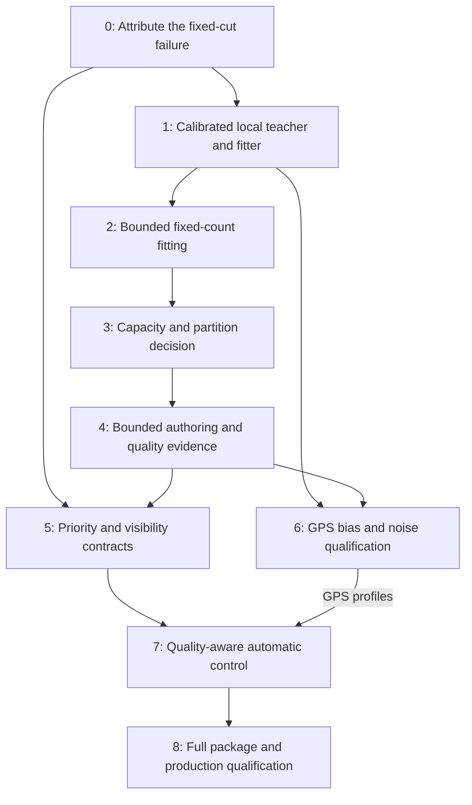

# Poland LoD quality: implementation and qualification plan

Status, September 9, 2026: **full-scene visual qualification remains open**.
The [latest closeout](lod_temporal_quality.md#blocker-closeout-september-9-partial)
records smooth support, view-scoped omission, navigation retention and publication
fixes, including rejected faster runs that lost detail. The local aerial fit does
not generalize to its separate development view. Production gates remain open.
This document specifies
the evidence gates on `feat/lod`; implemented mechanisms and measured acceptance
are tracked separately below. It refines
the representation and acceptance work in [the engine plan](lod_engine_plan.md)
using [the completed Poland investigation](lod_poland.md).

The objective is a useful quality/cost frontier for this 106,447,647-record scene:
faithful close views, economical distant views, bounded streaming and rendering,
and controls that expose an unmet target when quality and resource limits cannot
both be satisfied. A working renderer, a smaller record count, and an acceptable
image are separate milestones.

### Implementation and acceptance ledger

The current bounded work is preserved under
`target/lod-roadmap/2026-09-08/poland-quality/`, `temporal-quality/` and `blocker-closeout/`.
The [current temporal results](lod_temporal_quality.md) separate the improved
held church result from the historical failed captures and fitting diagnostics,
which remain intact.

| Phase | Implemented in this iteration | Acceptance still required |
| --- | --- | --- |
| 0 | Same-submission cut capture and canonical coverage; streamed attribution; native source substitution identifies false opacity; exact context union for five physical crops | Independent raw-source correspondence; original-neighbor and wider-region controls |
| 1 | Calibrated crops and shared deployment frustum; immutable native context, owned transmittance, captured ties and local geometry coordinates; two real CPU/GPU seed-crop comparisons; both fit artifacts pass reload checks | Broader camera/profile and fitted-payload GPU parity |
| 2 | Both predeclared 24-step fits completed; geometry candidate selected before final evaluation; three of five tiny crops pass the image screen | Validation remains 32.31 dB / .895 SSIM; no representation is quality-qualified |
| 3 | Existing exact leaves and ownership/cardinality contracts retained | Measured capacity comparison and selected partition/cardinality recipe |
| 4 | Authenticated local extraction and fit provenance | Resumable selective authoring, authenticated empirical quality evidence, regional package qualification, authoring throughput |
| 5 | Inspectable whole-cohort GPU cuts; finite budget-cutoff spatial transitions; bounded mapping/publication ownership; stable OBB projection and smooth support; indexed eviction, shared leases and preserved GPU request priority; view-scoped physical omission after complete-cohort selection | Matched motion detail and image continuity; 16M/24M recovery; aerial proxy and interpolation quality |
| 6 | Bounded pixel-integrated GPS expectation oracle; 16-seed GPU comparison; explicit minimum SPP configuration and stale-policy rejection | Same-record Poland comparison, useful delivered-frame noise and quality; temporal reconstruction if required by the measured frontier |
| 7 | Sampling-floor coordination between inner SPP and outer view controls | Representation-aware quality floors and a qualified shared quality/cost policy; minimum SPP alone is not an image-quality guarantee |
| 8 | Explicit native request outcomes; actual spatial pipeline/cut/count receipts; attested Original-leaf tiles; 8M 1080p GPU timing and image route; settled aerial Original/control comparison | Whole-scene full-frame/tile contributor parity; failed aerial visual gate; complete motion/CPU responsiveness, deployed native/browser qualification and physical memory limits |

The September 8 held spatial comparison is 65.8376 dB / .9996114 SSIM against the
tiled Original reference, with zero changed nodes or pixels in nine adjacent
held comparisons. This improvement uses the existing package and does not
promote the failed local fits. CPU cache/scheduling fixes substantially reduce
commit cost. At 8M/24M, all 74 adjacent returned image pairs are identical and
both return endpoints match the initial image; local forward/reverse differences
remain. A settled camera-471 crop fails against Original at 20.14 dB / .486 SSIM,
and disabling interpolation on the identical cut still fails at 20.73 dB / .542.
This isolates a static proxy-quality defect with additional interpolation error.
The [temporal report](lod_temporal_quality.md) preserves exact evidence and scope;
the historical phase gates below remain the acceptance contract.

The first real capture in this iteration reproduced the church failure at
18.547857 dB / .276310 SSIM. Its frozen cut covers all 106,447,647 source records
exactly once and expands to 15,996,538 selected records. Attribution identifies
two 8,192-source/1,024-proxy owners that together supply 70.8–86.4% of the final
composited alpha weight at three inspected pixels. These weights identify
influence; they do not equal the isolated owned-layer opacity or prove the cause.

The initial local substitution is an invalid supervision result: PLY reimport
altered 96 immutable context records, and the fitting path lacked deployment
world-support culling. After correcting both, the native seed reproduces the
full-cut CPU RGB exactly at pixel (480,319). Replacing owners 8484 and 8435 with
their originals changes owned transmittance from .170471 to 1 and composed RGB
from (.140804,.185357,.073791) to (.091409,.096557,.050253). This removes their
false-positive opacity and reduces pixel RGB MSE against the earlier subset
reference by 69.3%; remaining context still contributes haze. The result qualifies
this pixel substitution, not a whole crop, a fitted representation, or GPU parity.

The 16-seed synthetic GPS fixture passes its expectation/noise comparison:
ensemble bias RMSE .008981 against estimated Monte Carlo standard-error RMSE
.009103, with explicit quantization and integration allowances. Individual-frame
RMSE remains .0350–.0384. This is a local stochastic-process check, not acceptance
of Poland's GPS images or proof of universal renderer parity.

The [bounded implementation results](lod_poland_quality_results.md) record the
regional screen. The complete five-view context rejected 32×32 crops at the
unchanged record cap; the predeclared 16×16 fallback admits 12,015 context records.
Two camera-0 seed crops agree with the frozen GPU image at 54.6–56.6 dB and
.9990–.9996 SSIM. The geometry fit reduces training loss by 96.7%, survives PLY
reload, and passes the two church training crops plus the previously unused
frame-540 crop. Frame 300 still misses SSIM and frame 360 misses both image gates.
Both fits reached the 24-step ceiling, not the time ceiling. This bounded failure
does not prove that the representation lacks capacity; no extra optimization,
full rebuild, or production promotion is justified by these results alone.

## 1. What the evidence establishes

The [preserved report](../target/lod-roadmap/2026-09-08/poland/qualification-summary.json)
pins writer-17 manifest
`54da07e3cdc1a8e58c00c9691cd4bc7cfdc0e30b6eaffd6031dc7ed9d96a176f`
and final capture executable
`abb3948ecbb30a9e412b6b0c75eb977ae74ba2a682bc4591dd88b950e7e11248`.

| Observed configuration, 960×638 | Actual work | Diagnostic image result |
| --- | --- | --- |
| Ordered, camera 0, quality .95, 16M active ceiling | 15,996,538 selected; 10,960,624 drawn; 22 settled acknowledged samples; no pending page demand | 18.54747 dB / .276158 SSIM; haze remains |
| Ordered, camera 300 after route return | 14,935,787 selected; 3,831,900 drawn; 13 settled samples; median GPU view work 7.127616 ms | 68.06842 dB / .99998288 SSIM |
| Adaptive GPS, camera 300 after return | 896,034 selected; 48,127 projected; 18,838,957 point attempts in the final image | 10.32705 dB / .114360 SSIM |

Camera 0 is a near-ground church view. Resident-first admission fixed its held-pose
page churn; the record limit still forces a coarse cut. Camera 300 establishes a
strong original-leaf rendering result. It does not establish a useful reduced
representation. GPS's low timings occur with unacceptable image quality.

The reference images are conservative raw-source subsets, with explicitly
different source identities and capture schedules. They provide strong local
diagnostics, not strict full-source/whole-route qualification. Both route loops
applied 600 poses, but only ten ordered and fourteen GPS motion images had
receipts. GPS cadence completeness remains false. Device VRAM was not measured.

The strongest current explanation is that broad merged proxies alter occlusion,
and scarce refinement capacity leaves them visible. This is supported by the
code and images, but the contribution of representation, selection, support, and
ordering must still be isolated with fixed-cut substitutions. The plan must be
able to change direction if those substitutions identify another cause.

## 2. Decisions to carry forward

1. Use the original SH0 scene as the rendering teacher. The camera JSON is
   calibration, not photographic supervision. Do not invent absent training
   photographs or claim photometric reconstruction accuracy.
2. Reuse the existing perspective compositor and bounded fitter. The new work
   is calibrated projection, local extraction, context, representation capacity,
   and integration. Do not start another general covariance implementation.
3. Keep original leaves and an exact endpoint. Difficult close-up content may
   need substantially more records than distant content; a universal 8:1 merge
   is not a quality contract.
4. Qualify discrete representations and cuts before adding transition blending.
   A smooth transition between bad endpoints still fails the task.
5. Keep ordered rendering as a deterministic development reference. GPS gets
   separate tests for approximation bias, stochastic variance, and delivered
   image quality. Its lack of a Gaussian sort does not remove those requirements.
6. Preserve hard memory, work, and complete-cohort admission. A quality target
   cannot authorize exceeding a device limit. Report a degraded result explicitly
   if no admitted representation meets the requested quality.
7. Keep expensive work behind staged evidence gates. A failed bounded candidate
   is a failed candidate under that budget, not a proof that all fitting is
   impossible. It also does not justify an automatic optimizer sweep.

Hierarchical 3DGS provides relevant precedent for optimizing intermediate
representations after chunk construction; it does not validate this reducer or
its settings. [Kerbl et al., 2024](https://arxiv.org/abs/2406.12080)

GPS samples an opacity-corrected stochastic process and assigns work according
to projected size and opacity. It can render very large exact sets without LoD.
Our inference is that it may permit a less aggressive, higher-quality LoD
frontier; that must be measured in this WGSL implementation, including both
visibility passes. [Rijsdijk et al., 2026](https://jorisar.nl/gaussian_point_splatting/)

## 3. Baseline gaps and implementation constraints

This table records the starting implementation inspected for this plan. Use the
implementation ledger above for work completed since that inspection.

| Layer | Existing implementation to retain | Missing work |
| --- | --- | --- |
| Source/build | Bounded canonical sorting, authenticated original leaves, deterministic parallel hierarchy construction | Partial cohort export, explicit fit provenance, incremental authoring jobs |
| Reduction | `MomentMergeReducer`, risk-ranked adjacent groups, conservative support and mass-related policy | Perspective composited appearance, depth-layer separation, variable local representation capacity |
| Spatial repair | Same-depth sibling alpha probes and tangent-width adjustment | Within-node haze, full perspective context, mixed-depth/cross-cohort image qualification |
| CPU fitting | Complete source-over gradients, bounded tiles/tape, SH/opacity and optional geometry, per-record feasibility | Independent focal lengths, physical crops, immutable context, local-domain lineage, scale-aware geometry steps |
| GPU selection | AABB refinement tests, whole cohorts, future-demand reservations, resident-first passes | Stable visual priority across levels/clouds; view-dependent omission contract |
| GPS | Opacity-corrected proposals, clipped ROI envelope, bounded work, shared visibility, SPP controller | Same-record bias/variance isolation, useful low-noise operating points, temporal reconstruction if required |
| Automatic control | Timestamp feedback, limited cap trials, stale-feedback rejection and rollback | A quality floor tied to qualified representations; backend cost and noise treated separately |
| Evidence | Same-submission images/counts, timestamps and owned-allocation ledger | Complete requested-sample outcomes, dense short motion windows, deployed-resolution quality and physical memory qualification |

Important constraints that affect implementation order:

- `hierarchy.rs::build_node` derives parent count from child count and branching
  factor. The common near-leaf step is approximately 8,192 originals → 1,024
  proxies, with a 7,168-record all-child refinement cost. It rejects an internal
  representation larger than `leaf_capacity`; a 2,048-record candidate is not
  an interchangeable replacement for today's 1,024-record page.
- Source domains are positive contiguous intervals in canonical Morton order.
  They are not raw PLY row offsets. The canonical sorter also uses record content
  and original ordinal for ties.
- The monotone morph map rounds parent boundaries to child-record boundaries
  and enforces surjectivity. It describes transition correspondence, not an
  exact per-proxy record of the reducer's original contributors. Whole-node
  source domains are suitable for exact substitutions; per-proxy causal claims
  require separately retained or recomputed source partitions.
- GPU cohort admission assumes total child record count is at least the parent
  count. The current morph map has related cardinality/run-length constraints.
  Adaptive construction must preserve these or introduce an explicitly tested
  new contract.
- `source/export_rung.rs` exports whole global depths and admits only a 64 MiB
  manifest and 65,536 pages. Poland's manifest is 148,617,843 bytes with 118,808
  pages. `source/fit.rs` also assumes a complete source antichain and a 64 MiB
  manifest. Raising limits alone does not create a bounded local-fit workflow.
- The fitting camera accepts `from/target/up` and one vertical FOV. Poland uses
  distinct `fx/fy`. The fitter currently uses fixed three-sigma support for both
  teacher and candidate; production flat and authored LoD support policies can
  differ. Its existing sparse native-pixel grid is not an arbitrary image crop.
- Ordered quads use radial camera-to-mean ordering; GPS uses projected center
  depth. A cross-backend difference is not automatically stochastic noise.
- The current `high_fidelity_certificate` is not a held-out composited-image
  error certificate. Renaming a measured residual into that field would not
  make its existing assumptions applicable.

## 4. Dependency order



Selection diagnostics and same-record GPS checks can proceed alongside fitting.
Promotion of quality-aware runtime behavior depends on qualified representation
evidence. GPS/SPP gates apply to GPS profiles; an ordered-only profile can advance
through its own fixed-budget and outer-controller gates. The dependency does
not require another full-scene build at each step.

## 5. Phase 0 — make the church failure attributable

**Deliverable:** a small reproducible local failure with exact ownership and a
controlled original-contributor substitution.

Freeze the current source, package, executable, settings, camera and selected
cut identities. Add a bounded diagnostic export of the selected node IDs and
their decision reasons: target pressure, residency, record/visit/frontier limit,
and whether their support intersects the inspected pixels. This must be a
testing/capture facility; normal rendering must not read the active list back
to the CPU every frame.

Use the existing attributed CPU image helper on admitted local data, and add a
bounded GPU diagnostic if needed to locate contributors in the full cut. Start
with one church neighborhood. Admit at most two additional cases: a different
church boundary/depth-layer arrangement and a camera-300 control. A distant node
whose oversized support reaches the church is a valid suspect; center proximity
alone must not select the case.

For each case preserve:

- Complete owned canonical source intervals and authenticated leaf records.
- Current seed records and stable node/record IDs, page hashes and decoded hashes.
- The inspected physical-pixel region and calibrated pose.
- Unchanged neighboring context, including foreground occluders and interleaved
  depth layers. Inclusion uses the union of original-source support, actual
  frozen-cut proxy support and permitted fitted support, with deployment filter
  expansion. Source-only overlap could omit the oversized proxy causing haze.
- The actual mixed-depth cut and a second context using original neighbors.

Render four controlled states: current cut, current cut with only the target
owner replaced by exact originals, isolated owned originals, and isolated owned
proxies. Re-sort the complete combined context after substitution using the
declared renderer order. Do not render context once as a background image when
its records can interleave with fitted records.

Original leaves provide the first authenticated source-derived teacher. Check
their correspondence to raw PLY records independently through canonical replay
or a retained ordinal map. Never relabel a subset SHA as the full source SHA.

**Gate:** the exact replacement must materially remove the identified defect,
and the local diagnostic must reproduce it. If it does not, investigate support,
ordering, admission, or several interacting owners before optimizing. If exact
context exceeds the cap, reduce the image region or select a smaller complete
case; do not omit an arbitrary contribution tail.

**Touchpoints:** `source/export_rung.rs`, `source/fit.rs`,
`render_oracle.rs::render_production_lod_linear_gaussians_with_nodes`,
`render/traversal/gpu.rs`, and the native capture source/receipt code.

## 6. Phase 1 — make local supervision match deployment

**Deliverable:** one shared camera/render-profile description, explicit fitted
versus immutable records, and CPU/GPU parity for the admitted Poland cases.

Extend the existing test camera/projection types to carry calibrated projection
or independent focal lengths and principal point. Reuse `camera/path.rs` for
pose conversion. Preserve roll, near-plane behavior, viewport origin, pixel
centers, independent image scaling, and physical crop offsets. A crop changes
the evaluated pixels; it must not zoom the scene or change filtering.

Make teacher/candidate support, Mip filtering, determinant opacity compensation,
color conversion, alpha clamp, ordering and output/background policy explicit.
Run an exact-source control through CPU, flat GPU, and ordered GPU with identical
records. Also run a declared fixed-support comparison to isolate support-policy
differences. Fix discrepancies before using the CPU loss to select a fit.

Add immutable context and a trainability mask to the existing fitter. Context
participates in projection, sorting, compositing and resource admission, but its
parameters and ownership never receive updates. Extend the exporter/fitter with
a typed partial-domain contract instead of pretending a local case covers the
whole manifest. Admit manifest metadata separately from the bounded fit payload.

Keep native pixel supervision. Two viable bounded starting configurations are:

- Up to twelve 192×192 physical crops: 7,077,888 retained RGBA-f32 teacher bytes.
- Three 480×319 grids at stride two from 960×638: 7,349,760 retained teacher bytes.

Both fit the current 8 MiB teacher ceiling at 16 bytes per pixel. For the split
objective in Phase 2, store composed RGB plus owned-layer transmittance in those
four channels with an explicit target layout, rather than labeling it ordinary
RGBA. Its teacher construction and gradient are new work. If RGBA and a separate
transmittance array are retained instead, charge 20 bytes per pixel and reduce
admission to eleven crops or two stride-two grids. Charge additional forward/
backward passes to the work and time ceilings in either implementation.

Use physical crops when more views are needed; reject or stream additional
teacher images under an explicit total working-set limit. Do not silently turn
a 960×638 objective into low-resolution rendering. Sparse grids still require
full-image evaluation after fitting.

Audit geometry parameter units. The existing 0.002 world-unit mean step is not
automatically appropriate for a kilometer-scale scene. Prefer local coordinate
normalization and dimensionless trust regions, transforming cameras/support
consistently and checking roundtrip projection, over an arbitrary learning-rate
increase. Keep per-representative backtracking and fresh complete-render proposal
acceptance; a support/order discontinuity is not a valid local gradient proof.

**Gate:** extend the existing oracle with a few mechanism-specific cases:
independent focal lengths and crop origin; a real overlapping church case;
near/frustum-edge support; and a radial-versus-center-depth witness. Preserve
existing numerical bounds. Export/reload roundtrip error must also be measured.
No broad covariance sweep is needed.

**Touchpoints:** `testing/lod_scenes.rs`, `camera/path.rs`,
`testing/render_oracle.rs`, `testing/render_oracle/fit.rs`,
`testing/lod_runtime_capture/source/{fit,export_rung}.rs`,
`tests/lod_cpu_gpu_oracle.rs`, `render/projection.wgsl`.

## 7. Phase 2 — test the existing fixed-count representation

**Deliverable:** a bounded fit report comparing unchanged seed, accepted fit,
and exact contributors at identical poses and physical pixels.

Use SH0, current owner domains and record order. Begin with appearance/opacity
optimization; permit one geometry-enabled candidate only after the forward model
passes and training/validation evidence supports it. Reuse tiled compositing,
analytic appearance gradients, local geometry Jacobians, per-representative
feasibility and complete proposal acceptance. Do not restart Adam with many
learning rates or consult test cameras to select a checkpoint.

The central objective is rendered appearance, not covariance resemblance. A
useful initial form is:

```text
L = mean_training_views( RGB_error_in_fixed_context
                      + lambda_T * owned_cohort_transmittance_error )
```

Use linear premultiplied RGB. For the isolated owned layer, `T = 1 - alpha`;
alpha and transmittance are the same scalar error, so do not count both as
independent objectives. Whole-scene alpha is often nearly one and cannot expose
which depth layer became opaque. Supervise the owned layer as well as its
composition with frozen context. If an occlusion ambiguity remains, add fixed
depth-prefix transmittance probes as a separately declared diagnostic/objective;
do not assume final RGBA alone identifies depth structure.

Freeze spatial weights and error regions before fitting: church wall/roof,
foreground foliage, empty space, sky boundary and background leakage. Report
RGB, transmittance, local contrast, support spill and the worst occupied image
tiles. Differentiable edge or support regularization is a conditional addition
only when these diagnostics expose a failure that the initial objective cannot
resolve. Do not add a collection of tunable penalties preemptively.

Select training and validation poses from calibrated geometry/coverage, with
angular and distance separation. Cameras 0 and 300 are development observations.
Inventory prior captured poses before naming any fresh evaluation set. Split by
separated path windows rather than alternating adjacent frames. Freeze final
evaluation images/poses before fitting and evaluate them only after selecting
the candidate using training and validation. Additional pose-only generated
views may test teacher-relative generalization, but are not real-photo evidence.

**Proposed experiment ceiling:** one initial case; at most three cases after the
first succeeds. At most two fit invocations per case, 24 updates per invocation,
60 seconds training and 90 seconds total each. Retain the 100,000 source-plus-
context, 30,000 candidate-plus-context, 128 MiB tape, 8 MiB teacher and 128M
pixel-visit hard ceilings. This is at most six fits/nine minutes of fit-timer
work, not an instruction to consume unused budget. Input/output time and RSS are
reported separately. Use a single bounded GPU evaluation batch after reloading
outputs; predeclare its invocation and wall-clock cap.

**Gate:** quality improvement must survive export/reload and unused evaluation
views. The existing 35 dB foreground PSNR / .98 SSIM screen remains the image
target. Local passes qualify only the admitted case/domain. If training improves
while validation worsens, stop the candidate. If the budget expires before
meaningful convergence, report an inconclusive bounded fit rather than a proof
of insufficient representation capacity.

## 8. Phase 3 — let difficult regions retain enough information

**Deliverable:** a measured local rate/quality frontier and one selected authoring
strategy, with its page and ownership implications specified.

If the fixed-count candidate misses quality, test one predeclared capacity
comparison on the same authenticated source domain: approximately 8:1 versus
4:1. A 2:1 or original endpoint may diagnose how much detail is needed, but does
not satisfy a fourfold-reduction objective. Do not force close church views to
meet an arbitrary ratio simply because mid/far views can.

Candidate choices, in decision order:

1. **Preserve the existing partition and improve its fit**, if it reaches the
   gate without greater capacity. This minimizes format/runtime changes.
2. **Use finer nested domains/intermediate rungs**, if the 7,168-record refinement
   jump or unrelated merged surfaces dominate. Keep contiguous source ownership
   and bounded fanout. Add intermediate levels only where their measured benefit
   exceeds their storage/selection cost.
3. **Allow bounded variable internal cardinality**, if a mixture needs more than
   1,024 records. Decouple source-leaf granularity, internal representation count,
   and physical page limits deliberately. The first implementation should still
   fit each representation in one bounded page where practical; multi-page
   representations require complete dependency-set admission throughout runtime.
4. **Change partition/seed construction**, if extra capacity with the current
   grouping still preserves haze. Use support/depth-layer and appearance-aware
   nested grouping or an importance-preserving original subset as a declared
   seed. Original-subset sampling is not automatically opacity-correct; qualify
   it with the same compositing objective. Unconstrained noncontiguous clustering
   requires an explicit new source-ownership format and is a larger change.

Record why a candidate wins: quality, actual visible work, projected area/opacity
mass, encoded/decoded bytes and authoring cost. A fit that uses fewer Gaussians
but creates larger opaque splats may lose on both ordered rasterization and GPS.

Preserve exact leaves, positive source partitions, parent/child coverage,
nondecreasing refinement cardinality, and morph-run bounds in the initial
integration. Do not reuse the present error/certificate values after fitting
without checking their assumptions. Recompute actual support and approximation
evidence from the emitted, reloaded payload. If ownership or cardinality changes,
give the recipe a new identity and validate the resulting package contract.

**Gate:** qualify isolated and frozen-context images, coarse/fine neighbors,
mixed-depth boundaries and a short camera movement before selecting the recipe.
At least one ordinary mid/far profile must target a useful fourfold post-cull
reduction; near views may retain more originals. Global scene quality must not
be inferred by adding independent per-node SSIM scores.

## 9. Phase 4 — integrate a bounded offline authoring pipeline

**Deliverable:** resumable regional authoring with authenticated quality metadata,
followed by one candidate full build only after regional acceptance.

Move the reusable fitting core into an authoring module behind `lod_build` when
it enters production use. Keep test wrappers thin; do not make ordinary package
loading depend on `testing`, an optimizer, or training images. Share camera and
render-profile contracts with the oracle instead of copying projection math.

Use a staged pipeline: canonical source → cheap seed/risk classification →
bounded difficult-cohort jobs → original-supervised fit/evaluation → actual
support/error update → page encoding/reload verification → atomic publication.
Supervise coarser levels from original leaves or an explicitly bounded teacher
cache, not only from previously compressed parents. That avoids accumulating
unmeasured approximation error through the tree.

Schedule by predicted working set and work, not only thread count. Account for
context, projections, gradients, optimizer state, teachers, tape, encoding and
concurrent jobs. Cache jobs by source/page identities, owner domain, camera split,
render profile, recipe/options, tool version and output codec. Reuse unchanged
authenticated pages in a new output package; never mutate a published shard.
Support cancellation/resume and deterministic accepted-output publication.

Measure authoring feasibility before scaling. With 1,024-record leaves, the
current counts imply about 14,855 internal nodes. Spending 180 seconds at each
would be approximately 743 serial hours before other work. This is a workload
estimate, not a fit benchmark. Blanket use of the diagnostic fitter is therefore
not the production plan. Fit selectively, batch reusable views/context, and
consider GPU fitting only after profiling identifies a bounded kernel/workload
whose acceleration is necessary. Preserve the CPU oracle as its correctness
reference; do not add a second unqualified optimizer path.

Store separate forms of evidence:

- Analytic structural facts: support bounds, exact source ownership, cardinality
  and resource bounds.
- Empirical approximation data: source/candidate identities, evaluator version,
  projection/support/filter/order profile, sampled angular/distance/scale domain,
  RGB/transmittance/local residuals, and evaluation role.
- Runtime cost summaries: records, projected footprint/opacity statistics,
  bytes, and observed backend work. These are estimates outside measured views.

An empirical residual is not an all-view error guarantee. Unknown or outside-
domain approximations must remain identifiable; a parent does not inherit a
child's passing image score. Preserve structural validation independently of
image qualification. Authenticate new metadata, bound its size, and version any
changed runtime contract. Existing supported package readers should remain clean
validated paths; do not introduce deprecated implementations or duplicate
streaming stacks for fitted assets.

**Gate:** regional package images match the standalone accepted candidates,
mixed cuts pass, original leaves remain exact, all memory/I/O work is bounded,
and observed authoring throughput supports a declared full-build ceiling.

## 10. Phase 5 — spend refinement capacity on visible error

**Deliverable:** a bounded, reproducible desired cut and streaming priorities that
retain whole-cohort safety while buying more quality per resource unit.

GPU `refinement_priority` now retains refinement eligibility and ranks each
breadth-first frontier in eight stable near-plane/error/footprint buckets. The
small GPU oracle passes, but cross-depth benefit ranking and a fixed-budget
church comparison remain open. Extend this bounded ranking with qualified
representation error, preserving stable ties. Sorting hierarchy candidates is distinct from sorting
millions of Gaussians for rendering and is compatible with GPS.

Use mandatory quality-floor violations first, then estimated visible error
reduction per marginal cost, with stable cloud/node ties and hysteresis. Bound
frontier storage, visits, candidate ranking work and demand output. A per-level
sort must not be described as global best-first search. Across clouds, preserve
mandatory root/fixed-source admission and distribute discretionary capacity by
scored benefit instead of equal shares alone.

Keep desired-cut choice separate from currently drawable coverage. A better
missing cohort must be able to displace a lower-value resident refinement
through a planned coarsen/load/refine transaction. Otherwise unconditional
resident preference can pin an inferior cut indefinitely. Preserve resident-first
behavior for equal-priority work and while an admitted replacement is loading.
Retain the parent until the complete requested cohort is resident; reserve both
future rendering capacity and the actual overlapping residency footprint.
Donor coarsening must preserve its applicable quality floor and other views'
ownership. If no such donor and overlapping residency fit, report blocked
admission instead of taking capacity from a protected presentation.

Carry cohort identity, priority and policy revision through GPU feedback,
`package/gpu.rs`, `runtime/gpu.rs`, transport deduplication and upload admission.
Deduplicate a physical page without forgetting the cohorts that require it.
Bound cancellation/reprioritization, retain needed siblings, and test camera
reversal and competing views. A frame-local priority that disappears into a page
set is insufficient.

Only after the ranked global cut is controlled, add optional view-scoped output:
every source domain must be represented or conservatively excluded for this
view. Today's AABB check gates refinement; it does not authorize dropping
offscreen parents/children. The omission contract must cover source and emitted
support, authored sigma, runtime scale, transforms/shear, Mip margin, near-plane
crossings, nonfinite values and rounding. Camera changes invalidate exclusions;
residency for multiple views is the union of their demand.

Visible child counts can be smaller than the parent even when the full child
cohort is larger. Introduce checked signed deltas or separate release/reserve
accounting before enabling that path. Root pins, immutable snapshots, retired
buffers and exact renderer/source/generation acknowledgements remain required.
Do not introduce splat-center Hi-Z culling: transparent centers do not prove
occlusion. Opaque mesh depth is a separate supported source of evidence.

**Gate:** one targeted CPU/GPU priority oracle, adversarial missing/competing
cohorts and multiview cases, then a fixed-budget church comparison. A selection
change advances on better image quality or lower equal-quality work, not just
fewer requests. Preserve the observed stationary no-churn result.

**Touchpoints:** `stream/hierarchy.rs`, `render/traversal/{traversal.wgsl,gpu.rs,
snapshot.rs,admission.rs}`, `stream/package/gpu.rs`, `stream/runtime/gpu.rs`.

The current GPU node layout is 80 bytes and the feedback header is 64 bytes.
New quality and priority data need checked, aligned Rust/WGSL layouts and bounded
side buffers or an explicit layout revision. Charge shared topology, aliased
roots, ranking scratch and overlapping retired snapshots through the existing
ledger. Update native/browser capture decoding with the same contract; do not
silently reuse padding as an unversioned public quality field.

## 11. Phase 6 — establish a useful GPS quality profile

**Deliverable:** separate approximation, stochastic and cross-renderer error
measurements, then an accepted fixed-budget GPS operating point if feasible.

Use identical admitted original records and identical admitted proxy records
with stable identities. The four basic comparisons are original/ordered,
proxy/ordered, original/GPS and proxy/GPS. Keep automatic controls disabled.
Record the actual cut, point layers, clipping/support, color, ordering/visibility
semantics and work admission for every image.

For statistical convergence, add or qualify a deterministic compositor matching
GPS center-depth visibility and pixel-integrated occupancy. For this continuous
Poisson process, a Gaussian's effective pixel opacity is:

```text
alpha_pixel = 1 - exp(-integral_pixel[-log(1 - alpha(x))] dx)
```

The integral uses the same truncated support, alpha clamps and physical pixel
area as sampling. Match depth ties and opaque-depth rejection as well. This is
an expectation model derived from the implemented process, not a claim that a
center-sampled alpha compositor is its exact reference. Use bounded numerical
integration with a declared integration-error allowance for local oracle cases.
Then compare independent-seed ensemble means to that reference. Also retain
comparison to the existing ordered renderer: pixel filtering and radial/center-
depth differences can remain even at infinite SPP. Increasing SPP cannot remove
that deterministic discrepancy. Any choice to unify production semantics is a
separate renderer change with fresh reference qualification, not a redefinition
of a failed metric.

Use a predeclared small seed schedule on local cases, for example 16 independent
samples with an extension to 64 only if the uncertainty remains unresolved.
Report bias estimates and variance/confidence separately; reaching the maximum
without resolving a bias question is inconclusive. An offline averaged image
does not establish the quality of one displayed frame.

Measure projection/scan, requested and dispatched proposals, accepted hits if a
bounded diagnostic is added, both visibility passes, resolve, SPP memory and
GPU view time. The `cap + 1` counter is an overflow lower-bound sentinel. A
zero-work overflow frame is not a fast valid frame. Preserve the sampled process:
no opacity reductions, dropped contributions or capped Poisson counts to obtain
an attractive timing. Refining a large opaque proxy may reduce point work while
increasing Gaussian count; the cost model must allow that direction.

If useful SPP cannot meet displayed quality within the time budget, evaluate
temporal reconstruction as an explicit next feature. Existing `temporal_sampling`
changes RNG; it does not accumulate or denoise images. Reprojection needs motion
and camera calibration, disocclusion rejection, stable logical identities across
page movement, and invalidation for cut/payload/projection/viewport changes.
Measure lag, ghosting and residual flicker at matched latency. Do not count a
long stationary accumulation as a moving-camera result.

**Gate:** deterministic approximation quality, GPS bias, and delivered-frame
noise/temporal quality must all pass their declared profile. If GPS cannot reach
the required frontier, retain ordered rendering as the qualified mode for that
profile; do not claim universal GPS superiority from the paper or record count.

## 12. Phase 7 — make automatic control respect quality

**Deliverable:** a shared outer policy driven by valid backend observations,
with separate approximation and sampling decisions and explicit limiting status.

Retain the GPS inner SPP controller and existing rollback/stale-feedback rules.
Generalize the outer view-budget policy so ordered and GPS renderers can report
their own costs. Ordered cost includes projection, surviving radix work and
footprint/overlap. GPS includes projection/scan, proposal work through both
passes, sampling layers and resolve. Page traffic/upload and CPU tails remain
separate resource constraints.

A minimum record count is not a quality floor. The floor must restrict choices
to representations supported by the accepted profile/domain and report unknown
quality outside it. Couple offline evidence with current-cut maximum pressure,
unknown-evidence coverage and limiter counts. Join displayed-quality status to
the actual successful renderer receipt using source, generation, submission,
view/transform and policy identities. Do not transfer a previous camera's
"satisfied" status to a new pose.

During a trial, change one actuator at a time. Observe matched policy epochs and
stable residency, amortize page/upload transients, reject stale samples and
retain a cooldown. Lower SPP only within the sampling-quality floor; coarsen only
within approximation quality limits. Consider refinement when it reduces GPS
proposal cost. Roll back on worse cost, work overflow, coverage loss or violated
quality policy. The controller must not repeatedly trade unseen visual loss for
a smaller timing number.

When the target is unattainable under hard caps, preserve a complete admitted
presentation when one remains valid and fits, and report its actual limiting
reason: loading, unknown quality,
quality floor, memory/record/work limit, missing timing, or measured time target
unmet. A held previous image is only current if its pose/target contract remains
valid. Distinguish a proven hard impossibility from a failed heuristic trial.
Cold one-SPP overflow or impossible root admission may leave no current complete
image; report that outcome explicitly rather than implying a fallback exists.

**Gate:** qualify fixed budgets first. For GPS, qualify inner SPP alone, outer
selection alone, then combined control; ordered profiles require their fixed
and outer-controller checks. Use a short warm camera, movement, teleport,
delayed-page and return sequence with deliberate feasible and infeasible targets.
Observe quality, overshoot, settling, trial/rollback history, feedback age, page
churn and memory, not only the final controller state.

**Touchpoints:** `render/point/{budget.rs,settings.rs,gpu.rs}`, `render/ordered/`,
`gaussian/lod_settings.rs`, `gaussian/lod_debug.rs`, capture receipts and viewer
status. Keep application settings centered on quality, frame time and memory;
do not require users to manually coordinate another collection of hidden caps.

## 13. Phase 8 — qualify and publish a scene profile

**Deliverable:** an accepted package/configuration on named hardware, or an
explicit report of which requirement remains unmet. Publication of the crate
still follows its separate release process.

First repair capture accounting. Preserve one terminal outcome per requested
sample, including skipped/no-current-image reasons and policy identity. Require
complete images and receipts throughout short dense motion windows after declared
warmup. Retry logic must not make missing samples disappear. Run a complete route
only after these windows and regional quality pass.

Build one full candidate package under a frozen authoring budget. Retain original
leaves and verify all changed payloads, metadata and source domains. Capture the
whole route at application cadence, not simply two rapidly advanced headless
frames per authored pose. Include cold load, warm movement, rapid reversal,
teleport, eviction, return, unload and reload. Initial coarse coverage and first
useful-quality image latency are separate measurements.

Use 960×638 for development continuity and 1920×1276 for a deployment profile
with the same aspect ratio. Inspect selected physical-pixel regions at the
authored 4946×3286 scale. A 1920×1080 product profile must specify cropping or
letterboxing and calibration rather than silently changing the image shape.
Freeze train/validation/test route windows and final quality thresholds before
using the candidate's test results.

| Requirement | Proposed acceptance policy |
| --- | --- |
| Image fidelity | Retain ≥35 dB foreground PSNR and ≥.98 SSIM against the source teacher for the declared deterministic/profile images; report full-frame metrics too |
| Local haze/edges | Proposed additional gate: ≥30 dB and ≥.95 SSIM on every fixed 128×128 tile with ≥10% foreground; fixed church/roof/sky regions must pass visual review |
| Transmittance | Proposed owned-layer gate: mean absolute error ≤.01 and p99 absolute error ≤.05 over a fixed support mask; also report full-scene alpha and empty-space spill |
| Useful reduction | Target ≥4× actual post-cull reduction and ≥2× complete-frame improvement on predeclared ordinary mid/far views at the same quality; do not impose that ratio on every close-up |
| GPS | Bias and delivered-frame/temporal quality pass; independent-seed averages alone cannot qualify displayed quality or performance |
| Motion | Dense requested samples accounted for, no unexplained missing image, no cut-induced haze/holes; evaluate candidate-minus-reference residual changes and ghosting |
| Responsiveness | Proposed deployment target: whole-frame p95 ≤16.7 ms, p99 ≤25 ms; report all >50 ms frames and LoD CPU p95 against the existing 1 ms objective |
| Loading | Report process-entry and renderer-ready origins, first coarse and first useful image, cold/warm cache, bytes requested/read/decoded/uploaded and the exact transport profile |
| Residency | Stable held-pose demand; bounded movement/return high-water; all transient and retired allocations charged; zero owned ledger after unload |
| Hardware | Qualify the actual intended memory class and browser/native profiles separately; the 96 GiB RTX does not qualify an 8 GiB device |

The local/transmittance and deployment-resolution values above are proposals,
not existing passing gates. Calibrate them once against exact-source controls
and a fixed perceptual review set in Phase 0, then freeze them before candidate
optimization. Do not loosen them after inspecting failed fits. Temporal residual
tolerances likewise need a fixed baseline/noise protocol before motion fitting
or reconstruction is tuned; do not invent a passed temporal score afterward.

Measure process RSS and device usage alongside the owned-allocation ledger.
Record overlap, retired snapshots, timestamp availability and device limits.
Separate capture/PNG overhead from normal application timings, and serialize
performance runs with other substantial CPU/GPU work. Repeat only enough to
estimate the declared timing distribution and resolve identified variability.

Use an exact-source baseline with measured post-culling work for reduction
ratios. The ordinary flat reference submits records that its shaders may later
reject, so its submitted-instance count cannot supply that denominator. If an
exact baseline cannot fit the target device, report that limitation and qualify
absolute quality/time/memory separately; do not manufacture a speedup from a
different device, a smaller teacher subset or an unavailable baseline.

After one Poland profile passes, run the existing distinct scene checks
(including Icecream/Garden and a structurally different small fixture), relevant
SH layouts, supported transforms and the native/browser hardware matrix. This
prevents a church-specific fit or shader change from being promoted as a general
engine solution.

## 14. Reviewable work items and stopping points

| Work item | Scope | Completion evidence |
| --- | --- | --- |
| Q1 | Bounded selected-cut/cohort export and authenticated local source/context | A reproducible fixed-cut haze substitution; partial-domain lineage validated |
| Q2 | Calibrated projection, crop and explicit render profiles | Focused CPU/flat/ordered parity on the same records and pixels |
| Q3 | Immutable fitting context and local objective | Seed/fit/original report under the fixed experiment ceiling; heldout role preserved |
| Q4 | One evidence-selected capacity/partition recipe | Local rate/quality frontier, ownership/page/morph implications and mixed-cut results |
| Q5 | Resumable bounded authoring and typed quality evidence | Accepted regional package roundtrip; measured build-cost projection |
| Q6 | GPU pressure, ranked cohort admission and persistent demand priority | Better fixed-budget quality, stable ties and no loss of whole-cohort safety |
| Q7 | Optional view-scoped omission with explicit coverage proof | Conservative exclusion, signed-budget and multiview/lifetime checks |
| Q8 | GPS same-record bias/noise and useful fixed-budget profile | Separate bias, variance, delivered quality and proposal-work evidence |
| Q9 | Shared quality-aware budget policy and receipt-based status | Feasible/infeasible target sequences with bounded trials and honest degradation |
| Q10 | Capture completeness and staged full-scene qualification | Accepted dense windows, full package/route and physical memory report |

Q1–Q3 are the immediate critical path. Q4 is conditional on their result, not a
mandate to add every candidate representation. Q6 diagnostics and Q8 parity can
run independently once their inputs are frozen. Q7 is valuable for scale but
must not delay learning whether the proxy representation itself can pass.

Do not schedule another full Poland fit/build, broad parameter sweep, hierarchy
rewrite, temporal renderer, compression project, or publication merely because
it appears later in this plan. Advance when the preceding evidence answers its
decision question. The first useful success is one bounded church replacement
that removes haze on unused views at a documented cost, with an implementation
path that can be applied efficiently to the rest of the scene.
